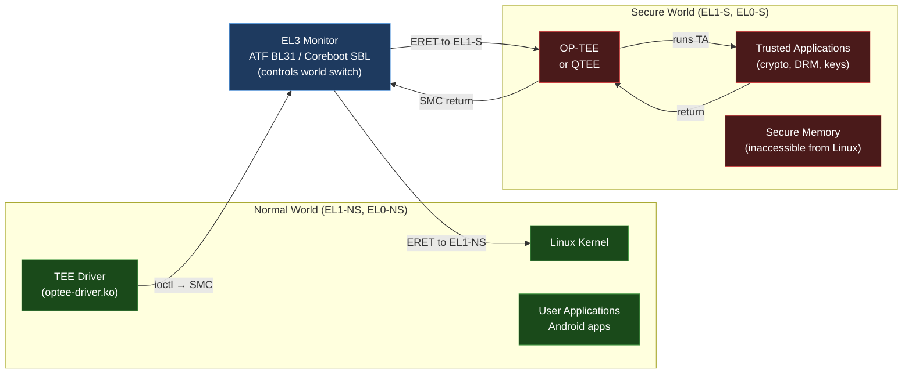

# 04 — Embedded Linux

> BSP development, device tree, Yocto/Buildroot, TrustZone/QTEE, and all the glue between hardware and kernel.

---

## Section Structure

```
04_Embedded_Linux/
├── 01_BSP_Development.md          ← What a BSP is + how to create one
├── 02_Device_Tree.md              ← DT syntax, bindings, debugging
├── 03_Yocto_BSP_Layer.md          ← See also 28_Yocto_Build_Mastery/
├── 04_Cross_Compilation.md        ← Toolchains, sysroots, CMake cross
├── 05_Boot_Media_Config.md        ← eMMC/SD/NOR partitioning
├── 06_TrustZone_QTEE.md           ← ARM TZ + Qualcomm QTEE (YOUR area)
├── 07_OP_TEE.md                   ← Open-source TEE implementation
├── 08_Secure_Boot.md              ← Chain of trust from eFuse
├── 09_Peripheral_Bring_Up.md      ← UART → I2C → SPI → USB → PCIe
└── 10_Labs/
    ├── Lab_01_QEMU_BSP_From_Scratch.md  ← See 29_QEMU_Embedded_AI_Labs/
    ├── Lab_02_Add_New_Peripheral.md
    └── Lab_03_TrustZone_TEE_App.md
```

---

## What Is a BSP?

```
BSP = Board Support Package

Everything that makes a generic Linux kernel work on a specific piece of hardware.

A BSP includes:
  ├── Bootloader (U-Boot/Coreboot) — configured for your SoC + board
  ├── ARM Trusted Firmware (ATF) — EL3 monitor, PSCI, TrustZone setup
  ├── OP-TEE (optional) — secure OS for TrustZone
  ├── Linux Kernel — configured with SoC + board-specific drivers
  ├── Device Tree Blob (DTB) — hardware description for the kernel
  ├── Root Filesystem — BusyBox or full distro
  └── Peripheral drivers — for your specific board's components

Without a BSP, the kernel boots on generic QEMU virt machine.
With a BSP, it boots on your specific RK3588 board with:
  - All 8 CPU cores online
  - NPU initialized
  - I2C sensors detected
  - PCIe NVMe working
  - HDMI output
  - WiFi/BT connected
```

---

## Device Tree — Complete Guide

### What DT Is (The Mental Model)

```
Problem without DT (pre-2012, mostly):
  Every board had its own kernel.
  Hardware description was hardcoded in C files (board files).
  Adding a new board = adding code to kernel.
  
Solution: Device Tree
  Hardware description = data file, not code.
  Kernel reads DT at boot → learns about the hardware.
  Same kernel binary boots on many different boards.

The analogy:
  DT = table of contents for the hardware.
  "Here is a UART at 0xfe650000, clock is 24MHz, uses IRQ 50."
  The kernel reads this, finds the UART driver, calls probe().
```

### DT Syntax

```dts
/* rk3588-rock-5b.dts — Radxa Rock 5B+ device tree */

/dts-v1/;
#include "rk3588.dtsi"     /* include SoC DT source */
#include "rk3588-rk806.dtsi" /* PMIC */

/ {                         /* root node */
    model = "Radxa ROCK 5B+";
    compatible = "radxa,rock-5b-plus", "rockchip,rk3588";
    
    /* Chosen: kernel gets these from U-Boot */
    chosen {
        stdout-path = "serial2:1500000n8";  /* UART2 at 1.5M baud */
    };
    
    /* Fixed regulator (not controlled by PMIC) */
    vcc_3v3_pcie: vcc-3v3-pcie-regulator {
        compatible = "regulator-fixed";
        regulator-name = "vcc_3v3_pcie";
        regulator-min-microvolt = <3300000>;
        regulator-max-microvolt = <3300000>;
        enable-active-high;
        gpio = <&gpio3 RK_PC6 GPIO_ACTIVE_HIGH>;  /* GPIO for enable */
    };
};

/* Override SoC UART2 for console */
&uart2 {
    status = "okay";
    pinctrl-0 = <&uart2m0_xfer>;
    pinctrl-names = "default";
};

/* Enable PCIe3x4 for NVMe */
&pcie3x4 {
    reset-gpios = <&gpio4 RK_PB6 GPIO_ACTIVE_HIGH>;
    vpcie3v3-supply = <&vcc_3v3_pcie>;
    status = "okay";
};

/* I2C sensor on bus 7 */
&i2c7 {
    status = "okay";
    pinctrl-names = "default";
    pinctrl-0 = <&i2c7m3_xfer>;
    
    temp_sensor: bmp280@76 {
        compatible = "bosch,bmp280";
        reg = <0x76>;
    };
};
```

### DT Binding — How Drivers Match

```bash
# The compatible string journey:

# 1. DT node has compatible:
#    compatible = "bosch,bmp280";

# 2. Kernel parses DT, creates platform_device with this compatible

# 3. Driver registers of_device_id table:
static const struct of_device_id bmp280_of_match[] = {
    { .compatible = "bosch,bmp280" },
    { }
};

# 4. Bus subsystem tries to match → "bosch,bmp280" matches → calls .probe()

# DT properties — common types:
# <&phandle>        = reference to another DT node (e.g., &gpio0)
# <0x100>           = u32 value in angle brackets
# "string"          = string property
# [00 01 02]        = byte array
# <0x0 0x1000 0x0 0x100> = 64-bit address + size pair
```

### DT Debugging

```bash
# On running board:
ls /proc/device-tree/          # DT in filesystem form
cat /proc/device-tree/model    # board model string

# Find your node:
find /proc/device-tree -name "compatible" -exec \
  sh -c 'echo "$1: $(cat $1)"' _ {} \; 2>/dev/null | grep bmp280

# DTB dump (from host):
dtc -I dtb -O dts rk3588-rock-5b.dtb -o decoded.dts

# Check if node is properly enabled:
fdtget rk3588-rock-5b.dtb /i2c@fec90000/bmp280@76 status

# Validate DT against binding schema:
make dtbs_check DT_SCHEMA_FILES=Documentation/devicetree/bindings/iio/pressure/bosch,bmp280.yaml
```

---

## TrustZone and QTEE (Your Experience)



### QTEE (Qualcomm TEE) vs OP-TEE

| Aspect | QTEE | OP-TEE |
|--------|------|--------|
| Open source | No (proprietary) | Yes (trustedfirmware.org) |
| Used by | Qualcomm Android/ChromeOS | Everyone else |
| Trusted Apps | .elf format + Qualcomm signing | .ta format + any signing |
| Debug | QXDM, proprietary logs | Serial UART, log buffer |
| Your experience | QTEE CoreBSP maintenance | Conceptual + OP-TEE for labs |

### SELinux and Android Security

```c
/* TrustZone from the driver perspective:
 * The kernel communicates with the secure world via:
 * 1. SMC calls (software interrupt to EL3)
 * 2. Shared memory (pre-allocated, physically fixed)
 * 3. Message queues in shared memory
 *
 * For QTEE: vendor-specific SMC handler
 * For OP-TEE: standardized via Global Platform TEE API
 */

/* Example: call into OP-TEE from kernel driver */
#include <linux/tee_drv.h>

/* Open TEE session */
struct tee_ioctl_open_session_arg arg = {
    .uuid = { /* TEE app UUID */ },
};
ret = tee_client_open_session(tee_ctx, &arg, NULL);

/* Invoke trusted application command */
struct tee_ioctl_invoke_arg inv = {
    .session = arg.session,
    .func    = MY_TA_COMMAND_ID,
};
ret = tee_client_invoke_func(tee_ctx, &inv, params);
```

---

## Interview Questions

**Beginner:**
- What is a BSP and what does it contain?
- What is a device tree and why does Linux use it?
- What is ARM TrustZone?

**Intermediate:**
- Explain how a DT compatible string causes a driver's probe() to be called.
- What is the difference between OP-TEE and Qualcomm QTEE?
- How would you add support for a new I2C sensor to a Yocto BSP?

**Advanced:**
- Explain the TrustZone memory split. How does ATF BL31 configure which memory is secure?
- How does the OP-TEE kernel driver communicate with the secure world? What kernel API is used?
- Design a BSP layer structure for a new RK3588-based industrial board. What files would you create?

**Expert (Using Your Experience):**
- Walk through the Qualcomm QTEE bring-up process for a new Snapdragon SoC. What are the CoreBSP team's responsibilities?
- How does Depthcharge verify the Linux kernel before booting it? What eFuse data is involved?
- A TrustZone memory access fault causes a kernel crash. How do you debug this? What tools are available in QTEE vs OP-TEE environments?

---

*Related: [05_Bootloaders/](../05_Bootloaders/) | [32_Complete_System_Design/](../32_Complete_System_Design/) | [28_Yocto_Build_Mastery/](../28_Yocto_Build_Mastery/)*
