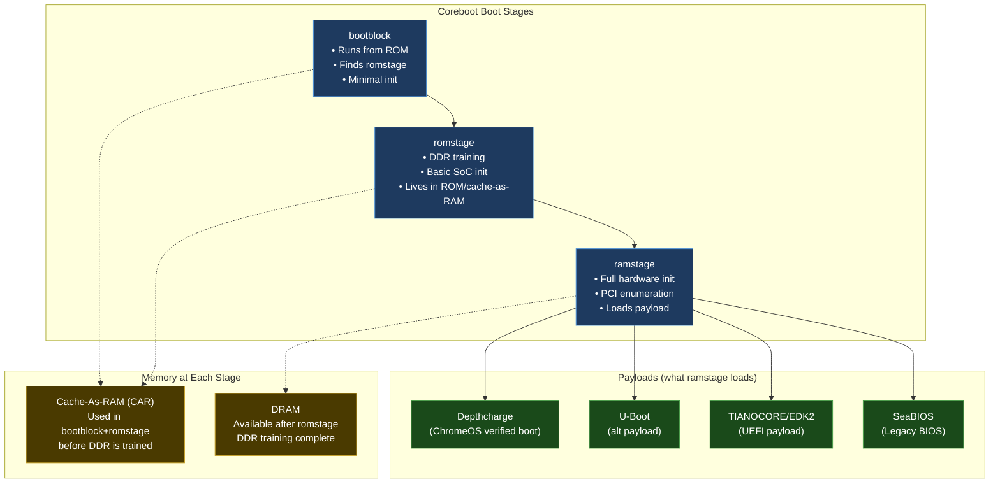
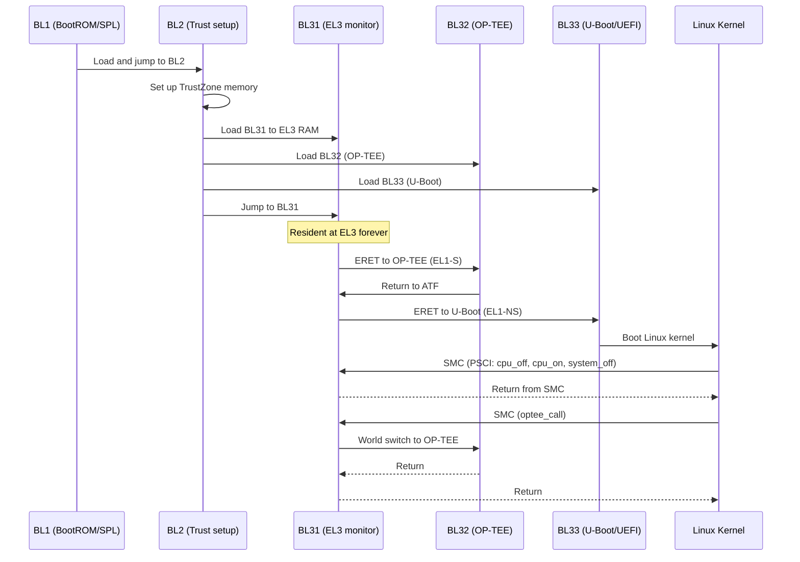

# 05 — Bootloaders

> U-Boot · Coreboot · Depthcharge · UEFI/EDK2  
> Your deepest experience is here. Time to document and extend it.

---

## Section Structure

```
05_Bootloaders/
├── 01_Bootloader_Overview.md         ← Role, types, boot chain
├── 02_U_Boot/
│   ├── 01_U_Boot_Architecture.md    ← Source tree, init sequence
│   ├── 02_U_Boot_Commands.md        ← All useful U-Boot commands
│   ├── 03_U_Boot_Environment.md     ← env vars, bootcmd, bootargs
│   ├── 04_U_Boot_DM.md             ← Driver Model in U-Boot
│   ├── 05_U_Boot_FIT_Image.md       ← FIT image format
│   ├── 06_U_Boot_Porting.md         ← Port to new board
│   └── 07_U_Boot_Debug.md           ← Debugging U-Boot
├── 03_Coreboot/
│   ├── 01_Coreboot_Architecture.md  ← Stages: bootblock→romstage→ramstage
│   ├── 02_Coreboot_Build.md         ← Build system, cbfstool
│   ├── 03_Coreboot_Porting.md       ← New board/SoC port guide
│   ├── 04_Coreboot_Debug.md         ← UART, CBMEM console
│   └── 05_Coreboot_SC7180_SC7280.md ← YOUR Qualcomm experience documented
├── 04_Depthcharge/
│   ├── 01_Depthcharge_Overview.md   ← ChromeOS bootloader payload
│   ├── 02_Verified_Boot.md          ← Vboot chain of trust
│   └── 03_Depthcharge_Debug.md      ← Debug ChromeOS boot
└── 05_ATF_And_OPTEE/
    ├── 01_ATF_Architecture.md       ← BL1/BL2/BL31/BL32/BL33
    ├── 02_PSCI_Deep_Dive.md         ← CPU hotplug, suspend, power down
    ├── 03_OPTEE_And_TEE.md          ← Secure OS, trusted apps
    └── 04_Secure_Boot_Chain.md      ← eFuse → verify each stage
```

---

## U-Boot Command Reference

```bash
# === Boot Commands ===
boot                    # execute bootcmd
bootm <addr>            # boot legacy image at addr
booti <kernel> - <dtb>  # boot ARM64 Image (- = use loaded initrd)
bootz <zImage> - <dtb>  # boot zImage

# === Memory Commands ===
md.b 0x80000000 0x20    # display 0x20 bytes at addr
mw.l 0x80000000 0xDEAD 1 # write 1 longword
cp.b src dst count      # copy bytes
crc32 0x80000000 0x1000 # checksum

# === Storage Commands ===
mmc list                # list MMC devices
mmc dev 0               # select MMC device 0
mmc info                # show device info
mmc read <addr> <blk> <cnt>  # read from MMC to RAM
mmc write <addr> <blk> <cnt> # write from RAM to MMC

ext4ls mmc 0:3          # list files on ext4 partition 3
ext4load mmc 0:3 0x80080000 /boot/Image  # load kernel

# === Network Commands ===
ping 192.168.1.1        # test network
dhcp                    # get IP via DHCP
tftp 0x80080000 Image   # load file via TFTP (fast for development!)
nfs 0x80080000 server:/path/Image  # NFS boot

# === Environment ===
printenv                # show all env vars
printenv bootargs       # show specific var
setenv bootargs "console=ttyS2,1500000 root=/dev/mmcblk0p5"
saveenv                 # save to storage

# === Debug ===
bdinfo                  # board info (memory map, clock)
version                 # U-Boot version + git hash
dm tree                 # Driver Model device tree
dm uclass               # all driver model uclasses
```

### U-Boot bootcmd for Radxa 5B+

```bash
# Standard bootcmd for Radxa Rock 5B+ (set via setenv):
setenv bootcmd 'run distro_bootcmd'

# Or manual:
setenv bootcmd \
  'mmc dev 0; \
   ext4load mmc 0:3 ${kernel_addr_r} /boot/Image; \
   ext4load mmc 0:3 ${fdt_addr_r} /boot/rk3588-rock-5b.dtb; \
   booti ${kernel_addr_r} - ${fdt_addr_r}'

# Development: TFTP boot (fastest iteration cycle)
setenv bootcmd \
  'dhcp; \
   tftp ${kernel_addr_r} ${serverip}:Image; \
   tftp ${fdt_addr_r} ${serverip}:rk3588-rock-5b.dtb; \
   booti ${kernel_addr_r} - ${fdt_addr_r}'
```

---

## Coreboot Architecture (Your Expertise)



### Coreboot SC7180/SC7280 — Your Work (Case Study)

```
What you built/maintained:
─────────────────────────────
• SC7180 = Qualcomm Snapdragon 7c (used in Lenovo IdeaPad 5i Chromebook, etc.)
• SC7280 = Qualcomm Snapdragon 7c Gen 2

Coreboot contribution areas:
  src/soc/qualcomm/sc7180/    ← SOC-specific code
  src/soc/qualcomm/sc7280/    ← SC7280 specific
  src/mainboard/google/        ← Google Chromebook board configs

Key files you likely touched:
  boardcfg.c                  ← board configuration
  fsp/                        ← Firmware Support Package glue
  qup_firmware/               ← QUP I2C/SPI/UART firmware blobs
  verstage/                   ← Verified boot stage

The 50-patch train:
  Your patches spanned: SOC init, board-specific hardware,
  QUP configuration, TrustZone handoff to Depthcharge
  
  Upstream: review.coreboot.org/q/owner:Ravi+Kumar+Bokka
```

### QFPROM eFuse Driver (Your Linux Kernel Contribution)

```c
/*
 * drivers/nvmem/qfprom.c — Qualcomm QFPROM eFuse driver
 * Your contribution: SC7180/SC7280 support
 * Upstream: https://lore.kernel.org/lkml/?q=qfprom+sc7180
 */

/* What QFPROM eFuse stores:
 * - Secure boot keys (used by BootROM to verify SPL)
 * - SoC revision bits
 * - Manufacturing calibration data
 * - Part number / SKU
 * - Customer-blown feature disable bits
 */

/* The driver exposes eFuse as nvmem cells:
 * /sys/bus/nvmem/devices/qfprom0/nvmem
 * 
 * Other drivers read from it via:
 * nvmem_cell_get(dev, "cell_name");
 * nvmem_cell_read(cell, &len);
 */

static const struct qfprom_soc_data sc7180_qfprom_data = {
    .accel_offset = 0x4420,
    .soc_id = 0x180,
};

static const struct of_device_id qfprom_of_match[] = {
    { .compatible = "qcom,sc7180-qfprom",
      .data = &sc7180_qfprom_data },
    { .compatible = "qcom,sc7280-qfprom",
      .data = &sc7280_qfprom_data },
    { /* sentinel */ }
};
```

---

## ARM Trusted Firmware (ATF) Deep Dive



---

## Interview Questions

**Beginner:**
- What is the difference between SPL and U-Boot proper?
- What is the bootcmd environment variable in U-Boot?
- What is Coreboot and why does Google use it for Chromebooks?

**Intermediate:**
- Explain Cache-as-RAM (CAR) technique. Why is it needed in Coreboot's romstage?
- What is Depthcharge and how does it implement verified boot?
- How does ATF BL31 differ from BL2? What is BL31's permanent role?

**Advanced:**
- Explain the Coreboot stage loading sequence. What makes bootblock special?
- How does U-Boot's Driver Model (DM) work? How is it different from legacy U-Boot?
- Design a secure boot chain for a Qualcomm SoC. Which keys are in eFuse? How does each stage verify the next?

**Expert (Based on Your Real Experience):**
- Describe the SC7180 Coreboot bring-up challenges. How did you handle QUP firmware integration?
- Your QFPROM eFuse driver is upstream. Walk through the patch review process — what feedback did you receive and how did you address it?
- How does the ATF BL31 SMC handler work? Trace a PSCI cpu_on call from Linux to ATF to hardware.

---

*Your upstream work: https://lore.kernel.org/lkml/?q=Ravi+Kumar+Bokka | https://review.coreboot.org/q/owner:brk4embed*  
*Related: [32_Complete_System_Design/02_Software_Artifacts/](../32_Complete_System_Design/02_Software_Artifacts/) | [04_Embedded_Linux/](../04_Embedded_Linux/)*
