# 06 — Linux Kernel

> From "I've used kernel APIs" to "I understand the kernel deeply enough to debug anything, contribute upstream, and design drivers for new subsystems."

---

## Section Structure

```
06_Linux_Kernel/
├── 01_Kernel_Architecture.md          ← Big picture: subsystems, layers
├── 02_Process_Management.md           ← task_struct, scheduler, kthreads
├── 03_Memory_Management.md            ← VM, buddy allocator, slab, mmap
├── 04_Interrupt_And_Timing.md         ← IRQ, softirq, tasklet, hrtimer
├── 05_Synchronization.md              ← spinlock, mutex, RCU, seqlock
├── 06_Device_Model.md                 ← kobject, bus, driver, device
├── 07_VFS_And_Filesystems.md          ← VFS, ext4, tmpfs, sysfs, procfs
├── 08_Network_Stack.md                ← sk_buff, TCP/IP overview
├── 09_Power_Management.md             ← suspend/resume, PSCI, runtime PM
├── 10_Kernel_Debugging.md             ← KASAN, UBSAN, lockdep, ftrace
├── 11_Kernel_Configuration.md         ← Kconfig, menuconfig, .config
└── 12_Labs/
    ├── Lab_01_First_Module.md
    ├── Lab_02_Proc_File.md
    ├── Lab_03_Workqueue.md
    ├── Lab_04_IRQ_Handler.md
    ├── Lab_05_RCU_Usage.md
    └── Lab_06_Memory_Debug.md
```

---

## The Kernel Architecture

```mermaid
flowchart TD
    classDef user fill:#1a3a1a,color:#fff,stroke:#4a9f4a
    classDef syscall fill:#1e3a5f,color:#fff,stroke:#4a90d9
    classDef subsys fill:#2d1a4a,color:#fff,stroke:#8b5cf6
    classDef driver fill:#1a3a3a,color:#fff,stroke:#4ab0b0
    classDef hw fill:#4a3a00,color:#fff,stroke:#c9a227

    APPS["User Space\nApplications\n(EL0)"]:::user
    
    subgraph SYSCALL["System Call Interface"]
        SC["sys_read, sys_write, sys_ioctl...\nEntry via SVC #0 (ARM64)"]:::syscall
    end
    
    subgraph CORE["Core Kernel Subsystems"]
        PM["Process Mgmt\ntask_struct\nscheduler (CFS)\nkthreads"]:::subsys
        MM["Memory Mgmt\npage allocator\nslab/slub\nvmalloc/mmap\nOOM killer"]:::subsys
        VFS_K["VFS\nFile operations\ninode, dentry\npage cache"]:::subsys
        NET_K["Network\nsk_buff\nTCP/IP stack\nnetdev"]:::subsys
        IPC_K["IPC\nfutex, pipes\nsignals\npthread sync"]:::subsys
    end
    
    subgraph GENERIC["Generic Driver Frameworks"]
        DMA_K["DMA Engine\nAsync DMA\nDMA descriptors"]:::driver
        IRQ_K["IRQ Domain\nGeneric IRQ\nchip + handler"]:::driver
        CLK_K["Clock Framework\nCCF — Common\nClock Framework"]:::driver
        REG_K["Regulator\nFramework"]:::driver
        PM_K["Runtime PM\n+ System Sleep\n(PSCI client)"]:::driver
    end
    
    subgraph DRIVERS["Device Drivers"]
        CHAR["Character\ndrivers"]:::driver
        BLOCK["Block\ndrivers"]:::driver
        NET_D["Network\ndrivers"]:::driver
        UFS_D["UFS/SCSI\nstack"]:::driver
        I2C_D["I2C/SPI\ndrivers"]:::driver
        GPU_D["DRM/GPU\ndrivers"]:::driver
    end
    
    HW["Hardware: CPU/DMA/Peripherals (EL0-EL2 physical access via MMIO)"]:::hw
    
    APPS --> SYSCALL --> CORE
    CORE --> GENERIC
    GENERIC --> DRIVERS --> HW
```



---

## Process Management Deep Dive

### The task_struct

```c
/* Simplified — actual struct has 700+ fields */
struct task_struct {
    /* State */
    volatile long state;           /* TASK_RUNNING, TASK_INTERRUPTIBLE, etc. */
    void *stack;                   /* kernel stack (16KB on ARM64) */
    
    /* Scheduling */
    int prio, static_prio;         /* priority */
    struct sched_entity se;        /* CFS scheduling entity */
    struct sched_rt_entity rt;     /* RT scheduling entity */
    
    /* Memory */
    struct mm_struct *mm;          /* memory descriptor (NULL for kernel threads) */
    struct mm_struct *active_mm;
    
    /* PID / relationships */
    pid_t pid, tgid;
    struct task_struct *real_parent;
    struct list_head children;
    struct list_head sibling;
    
    /* Files */
    struct files_struct *files;    /* open file descriptors */
    struct fs_struct *fs;          /* filesystem info (cwd, root) */
    
    /* Signals */
    sigset_t blocked, pending;
    
    /* Security */
    const struct cred *cred;       /* UID, GID, capabilities */
    
    /* Name */
    char comm[TASK_COMM_LEN];      /* "thread name" (16 bytes) */
};

/* Process states */
#define TASK_RUNNING         0   /* on runqueue or currently running */
#define TASK_INTERRUPTIBLE   1   /* sleeping, can be woken by signal */
#define TASK_UNINTERRUPTIBLE 2   /* sleeping, signal won't wake (D state!) */
#define TASK_STOPPED         4   /* stopped (SIGSTOP) */
#define TASK_ZOMBIE          8   /* exited, waiting for parent to wait() */
```

**Critical for driver writers:**
- Never sleep in interrupt context (softirq, tasklet, ISR)
- `TASK_UNINTERRUPTIBLE` = D state = unkillable = check your blocking code
- Kernel threads: `kthread_create()` + `wake_up_process()` or `kthread_run()`

### Scheduler Concepts

```
CFS (Completely Fair Scheduler):
  - All runnable tasks share CPU fairly (proportional to weight/nice)
  - Red-black tree ordered by vruntime (virtual runtime)
  - Task with lowest vruntime runs next
  - Preempted when vruntime > min_vruntime + slice

RT Scheduler:
  - SCHED_FIFO / SCHED_RR — for real-time tasks
  - Higher priority than CFS
  - Use for time-critical ISR bottom halves

Driver relevance:
  - CPU hotplug: drivers must handle core going offline
  - NUMA: on multi-socket, allocate memory near the CPU that uses it
  - CPU affinity: use set_cpus_allowed_ptr() for performance-critical threads
```

---

## Memory Management for Driver Writers

### The Memory Allocation Zoo

```
When to use what:

kmalloc(size, GFP_KERNEL)     — Physically contiguous, ≤ 4MB, most common
kzalloc(size, GFP_KERNEL)     — Same + zero initialized
devm_kzalloc(dev, size, GFP_KERNEL) — Auto-freed on driver detach (ALWAYS use this)

GFP flags:
  GFP_KERNEL   — can sleep, normal allocation
  GFP_ATOMIC   — cannot sleep (interrupt context), lower chance of success
  GFP_DMA      — memory accessible by DMA (low addresses, some platforms)
  GFP_NOWAIT   — kmalloc that won't sleep (like GFP_ATOMIC but softirq OK)

vmalloc(size)       — Virtually contiguous, physically scattered, ≤ system RAM
kvmalloc(size, ...)  — tries kmalloc first, falls back to vmalloc

get_free_pages()    — Raw page allocation (2^order pages, physically contiguous)

Kernel stack:
  Max: 16KB on ARM64
  Per-frame: be careful with large arrays!
  Large allocations → always heap (kmalloc/vmalloc)
```

### DMA Memory (Critical for Storage/Network Drivers)

```c
/* Coherent DMA — CPU and device see same data without explicit cache ops */
void *cpu_addr = dma_alloc_coherent(dev, size, &dma_addr, GFP_KERNEL);
/* Use cpu_addr from CPU side, dma_addr from device side */
dma_free_coherent(dev, size, cpu_addr, dma_addr);

/* Streaming DMA — device and CPU take turns (explicit sync needed) */
dma_addr_t dma_addr = dma_map_single(dev, cpu_ptr, size, DMA_TO_DEVICE);
/* ... set up DMA transfer ... */
/* After transfer FROM device: */
dma_sync_single_for_cpu(dev, dma_addr, size, DMA_FROM_DEVICE);
dma_unmap_single(dev, dma_addr, size, DMA_FROM_DEVICE);

/* DMA pools — for many small allocations (like UFS UPIU command descriptors) */
struct dma_pool *pool = dma_pool_create("ufshcd_cmd_pool", dev, 
                                         cmd_size, 64, 0);
void *cpu_addr = dma_pool_alloc(pool, GFP_KERNEL, &dma_addr);
dma_pool_free(pool, cpu_addr, dma_addr);
dma_pool_destroy(pool);

/* From your UFS work — CDB allocation is exactly dma_pool usage */
```

---

## Synchronization — The Complete Guide

```c
/* === SPINLOCKS === */
/* Use when: critical section is VERY short, or called from interrupt context */
DEFINE_SPINLOCK(my_lock);
spin_lock(&my_lock);          /* acquire — disables preemption */
/* critical section — CANNOT sleep, CANNOT call blocking code */
spin_unlock(&my_lock);

/* IRQ-safe spinlock — use when ISR and thread share data */
spin_lock_irqsave(&my_lock, flags);    /* saves IRQ state */
spin_unlock_irqrestore(&my_lock, flags);

/* === MUTEXES === */
/* Use when: critical section can sleep, process context only */
DEFINE_MUTEX(my_mutex);
mutex_lock(&my_mutex);         /* can sleep waiting */
/* critical section — CAN sleep, CAN call blocking code */
mutex_unlock(&my_mutex);

/* === RCU — Read-Copy-Update === */
/* Use when: many readers, rare writers, pointer-based data structures */

/* Reader side (lock-free! just prevents preemption) */
rcu_read_lock();
struct my_data *data = rcu_dereference(my_ptr);
/* use data... */
rcu_read_unlock();

/* Writer side */
struct my_data *old_data = my_ptr;
struct my_data *new_data = kmalloc(sizeof(*new_data), GFP_KERNEL);
*new_data = *old_data;
new_data->value = new_value;
rcu_assign_pointer(my_ptr, new_data);  /* atomic pointer swap */
synchronize_rcu();                      /* wait for all readers to finish */
kfree(old_data);

/* === COMPLETIONS === */
/* Use when: waiting for an event (DMA done, IRQ received) */
struct completion done;
init_completion(&done);

/* In driver: */
wait_for_completion_timeout(&done, HZ);  /* wait 1 second */
/* or: */
wait_for_completion_interruptible(&done);

/* In ISR or callback: */
complete(&done);  /* signal the waiter */
```

### Locking Anti-Patterns (Don't Do These)

```c
/* ❌ WRONG: sleeping with spinlock held */
spin_lock(&lock);
msleep(100);        /* This will crash or deadlock */
spin_unlock(&lock);

/* ❌ WRONG: mutex in interrupt context */
irqreturn_t my_isr(int irq, void *dev) {
    mutex_lock(&lock);  /* DEADLOCK if lock is already held by interrupted code */
    ...
}

/* ❌ WRONG: forgetting to unlock on error path */
mutex_lock(&lock);
if (error) return -EINVAL;  /* Lock never released! */
mutex_unlock(&lock);

/* ✓ CORRECT: goto cleanup pattern */
mutex_lock(&lock);
ret = do_something();
if (ret)
    goto unlock;
ret = do_something_else();
unlock:
    mutex_unlock(&lock);
    return ret;
```

---

## Interrupt Handling

```c
/* === REQUEST IRQ === */
/* devm_ version — auto-freed on driver removal */
ret = devm_request_irq(dev, irq, my_isr, 
                        IRQF_SHARED | IRQF_TRIGGER_RISING,
                        "my_driver", priv);

/* === ISR (TOP HALF) === */
/* Rules:
 * - CANNOT sleep
 * - CANNOT call blocking functions
 * - Should be FAST (microseconds max)
 * - Use spin_lock_irqsave for shared data
 */
static irqreturn_t my_isr(int irq, void *dev_id)
{
    struct my_priv *priv = dev_id;
    u32 status;
    
    status = readl(priv->base + REG_STATUS);
    if (!(status & STATUS_IRQ_PENDING))
        return IRQ_NONE;  /* not our interrupt (shared IRQ) */
    
    /* Clear interrupt */
    writel(STATUS_IRQ_PENDING, priv->base + REG_STATUS);
    
    /* Wake up sleeping thread (workqueue/tasklet for heavy work) */
    queue_work(priv->workqueue, &priv->work);
    
    return IRQ_HANDLED;
}

/* === WORKQUEUE (BOTTOM HALF) === */
/* Use for heavy processing after IRQ */
/* Can sleep, can allocate memory */
static void my_work_handler(struct work_struct *work)
{
    struct my_priv *priv = container_of(work, struct my_priv, work);
    
    /* Process data from ISR */
    /* Can sleep here */
    mutex_lock(&priv->lock);
    process_data(priv);
    mutex_unlock(&priv->lock);
    
    /* Signal completion */
    complete(&priv->done);
}

/* In probe: */
INIT_WORK(&priv->work, my_work_handler);
priv->workqueue = alloc_workqueue("my_wq", WQ_UNBOUND | WQ_HIGHPRI, 0);
```

---

## Key Kernel APIs Quick Reference

```c
/* ─── MEMORY ─────────────────────────────────────────── */
devm_kzalloc(dev, size, GFP_KERNEL)     // auto-free, zeroed
devm_kmalloc(dev, size, GFP_KERNEL)     // auto-free
kfree(ptr)                              // manual free
IS_ERR(ptr) / PTR_ERR(ptr)             // error pointer checks
ERR_PTR(-ENOMEM)                        // encode error in pointer

/* ─── DEVICE TREE ───────────────────────────────────── */
of_property_read_u32(node, "reg", &val)
of_property_read_string(node, "label", &str)
devm_gpiod_get(dev, "reset", GPIOD_OUT_LOW)
devm_clk_get(dev, "core")
devm_regulator_get(dev, "vcc")
platform_get_resource(pdev, IORESOURCE_MEM, 0)
devm_ioremap_resource(dev, res)

/* ─── LOCKING ────────────────────────────────────────── */
DEFINE_SPINLOCK(lock) / spin_lock/unlock(&lock)
DEFINE_MUTEX(lock) / mutex_lock/unlock(&lock)
init_completion(&comp) / complete(&comp) / wait_for_completion(&comp)
DEFINE_WAIT(wait) / add_wait_queue / wake_up

/* ─── DELAYS ─────────────────────────────────────────── */
udelay(N)                               // busy-wait microseconds (N < 1000)
mdelay(N)                               // busy-wait milliseconds
usleep_range(min_us, max_us)            // sleep microseconds (can schedule)
msleep(N)                               // sleep milliseconds (can schedule)
ssleep(N)                               // sleep seconds

/* ─── PRINTING ───────────────────────────────────────── */
dev_err(dev, "error: %d\n", ret)        // device-context (preferred)
dev_warn(dev, "warning\n")
dev_info(dev, "info\n")
dev_dbg(dev, "debug\n")                 // only with dynamic_debug
pr_err("error: %d\n", ret)             // no device context
pr_warn / pr_info / pr_debug

/* ─── SYSFS ─────────────────────────────────────────── */
static DEVICE_ATTR(name, 0644, show_fn, store_fn)
device_create_file(dev, &dev_attr_name)
device_remove_file(dev, &dev_attr_name)
```

---

## Interview Questions

**Beginner:**
- What is the difference between kernel space and user space?
- What is a kernel module? How is it different from a built-in driver?
- What is `GFP_KERNEL` and when can you use it?

**Intermediate:**
- Explain the difference between a spinlock and a mutex. When would you use each?
- What is the difference between a tasklet, a workqueue, and a timer? When do you use each?
- What does `TASK_UNINTERRUPTIBLE` (D state) mean? How can a driver cause it?

**Advanced:**
- Explain RCU. Why is it useful for data structures that have many readers?
- How does DMA coherency work on ARM64? When do you need explicit cache maintenance operations?
- Explain the difference between `devm_kzalloc` and `kzalloc`. When would you NOT use devm?

**Expert:**
- Explain the Linux kernel memory model (LKMM). Why does it matter for lockless programming?
- Design a driver that implements a hardware ring buffer (like a network TX ring). How would you handle the head/tail pointers with multiple CPUs?
- How does lockdep work? Explain how it detects potential deadlocks at runtime.

---

*Labs: [12_Labs/](12_Labs/) | Related: [07_Device_Drivers/](../07_Device_Drivers/) | [09_Debugging/](../09_Debugging/)*
