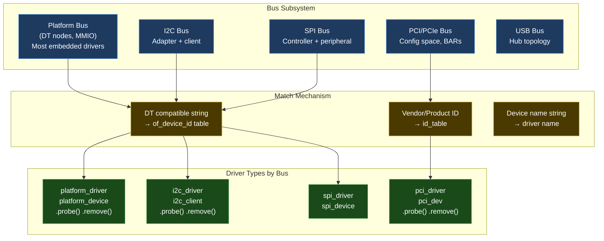
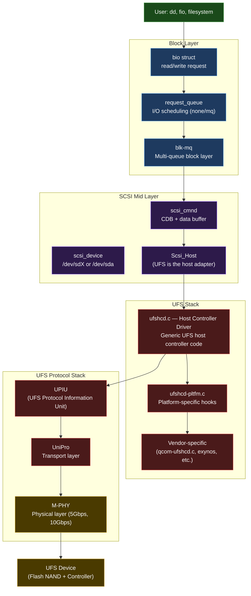

# 07 — Device Drivers

> From "I can modify an existing driver" to "I can design and write any driver type from scratch, upstream it, and explain every line."

---

## Section Structure

```
07_Device_Drivers/
├── 01_Driver_Model_Overview.md         ← platform, PCI, I2C, SPI, USB
├── 02_Character_Drivers.md             ← /dev/mydevice from scratch
├── 03_Platform_Drivers.md              ← DT-based platform drivers (most embedded)
├── 04_I2C_Drivers.md                   ← I2C client + adapter drivers
├── 05_SPI_Drivers.md                   ← SPI device drivers
├── 06_Regmap_Framework.md              ← Register abstraction (I2C/SPI/MMIO)
├── 07_GPIO_And_Pinctrl.md              ← GPIO consumer + controller drivers
├── 08_Clock_Driver.md                  ← CCF clock driver
├── 09_DMA_Engine_Driver.md             ← DMA engine framework + descriptor ring
├── 10_Block_Drivers.md                 ← block_device, request_queue, bio
├── 11_UFS_SCSI_Stack.md               ← UFS + SCSI deep dive (your specialty)
├── 12_Labs/
│   ├── Lab_01_Char_Driver_From_Scratch.md
│   ├── Lab_02_Platform_Driver_With_DT.md
│   ├── Lab_03_I2C_Driver.md
│   ├── Lab_04_Sysfs_Interface.md
│   ├── Lab_05_DMA_Driver.md
│   └── Lab_06_Block_Driver.md
└── 13_Upstream_Contribution_Guide.md   ← How to get your driver upstream
```

---

## Driver Model Overview



### The Universal Driver Lifecycle

```
1. Driver registers with bus subsystem:
   platform_driver_register(&my_driver);
   → kernel stores driver in bus's driver list

2. When device is found (DT parsing, PCI scan, USB plug):
   → bus tries to match device to registered drivers
   → match: calls driver.probe()

3. driver.probe():
   → Allocate per-device private data (devm_kzalloc)
   → Map MMIO registers (devm_ioremap_resource)
   → Get clocks, regulators, GPIOs (devm_clk_get, etc.)
   → Request IRQ (devm_request_irq)
   → Register with subsystem (cdev_add, net_dev_register, etc.)
   → Start hardware (clock enable, power up)
   → Return 0 on success, negative errno on failure

4. driver.remove():
   → Stop hardware
   → Unregister from subsystem
   → devm_ resources freed automatically

5. Device removed (USB unplug, DT device disabled, etc.):
   → bus calls driver.remove()
```

---

## Platform Driver: Complete Example

```c
/*
 * example_platform.c — Complete platform driver with DT binding
 *
 * Implements a simple hardware counter peripheral with:
 * - Counter value exposed via sysfs
 * - Overflow interrupt
 * - Clock and power managed correctly
 *
 * Compile: make -C /path/to/kernel M=$(pwd) ARCH=arm64 \
 *               CROSS_COMPILE=aarch64-linux-gnu- modules
 */
#include <linux/module.h>
#include <linux/platform_device.h>
#include <linux/of.h>
#include <linux/clk.h>
#include <linux/interrupt.h>
#include <linux/io.h>
#include <linux/sysfs.h>
#include <linux/pm_runtime.h>

/* Register offsets */
#define COUNTER_VAL     0x00
#define COUNTER_CTRL    0x04
#define COUNTER_IRQ_ST  0x08
#define COUNTER_IRQ_EN  0x0C

#define CTRL_ENABLE     BIT(0)
#define CTRL_RESET      BIT(1)
#define IRQ_OVERFLOW    BIT(0)

struct counter_priv {
    struct device *dev;
    void __iomem *base;
    struct clk *clk;
    int irq;
    u32 overflow_count;
    spinlock_t lock;
};

/* --- MMIO helpers --- */
static inline u32 counter_read(struct counter_priv *p, u32 reg)
{
    return readl(p->base + reg);
}

static inline void counter_write(struct counter_priv *p, u32 val, u32 reg)
{
    writel(val, p->base + reg);
}

/* --- IRQ handler (top half) --- */
static irqreturn_t counter_isr(int irq, void *dev_id)
{
    struct counter_priv *p = dev_id;
    u32 status;

    status = counter_read(p, COUNTER_IRQ_ST);
    if (!(status & IRQ_OVERFLOW))
        return IRQ_NONE;

    /* Clear interrupt (W1C) */
    counter_write(p, IRQ_OVERFLOW, COUNTER_IRQ_ST);

    spin_lock(&p->lock);
    p->overflow_count++;
    spin_unlock(&p->lock);

    dev_dbg(p->dev, "counter overflow #%u\n", p->overflow_count);
    return IRQ_HANDLED;
}

/* --- Sysfs attributes --- */
static ssize_t counter_show(struct device *dev,
                             struct device_attribute *attr, char *buf)
{
    struct counter_priv *p = dev_get_drvdata(dev);
    return sysfs_emit(buf, "%u\n", counter_read(p, COUNTER_VAL));
}

static ssize_t overflow_show(struct device *dev,
                              struct device_attribute *attr, char *buf)
{
    struct counter_priv *p = dev_get_drvdata(dev);
    unsigned long flags;
    u32 count;

    spin_lock_irqsave(&p->lock, flags);
    count = p->overflow_count;
    spin_unlock_irqrestore(&p->lock, flags);

    return sysfs_emit(buf, "%u\n", count);
}

static ssize_t reset_store(struct device *dev,
                            struct device_attribute *attr,
                            const char *buf, size_t count)
{
    struct counter_priv *p = dev_get_drvdata(dev);
    unsigned long val;

    if (kstrtoul(buf, 0, &val) || val != 1)
        return -EINVAL;

    counter_write(p, CTRL_RESET, COUNTER_CTRL);
    udelay(1);
    counter_write(p, CTRL_ENABLE, COUNTER_CTRL);

    spin_lock(&p->lock);
    p->overflow_count = 0;
    spin_unlock(&p->lock);

    dev_info(p->dev, "counter reset\n");
    return count;
}

static DEVICE_ATTR_RO(counter);
static DEVICE_ATTR_RO(overflow);
static DEVICE_ATTR_WO(reset);

static struct attribute *counter_attrs[] = {
    &dev_attr_counter.attr,
    &dev_attr_overflow.attr,
    &dev_attr_reset.attr,
    NULL
};

static const struct attribute_group counter_attr_group = {
    .attrs = counter_attrs,
};

/* --- Probe --- */
static int counter_probe(struct platform_device *pdev)
{
    struct counter_priv *priv;
    struct resource *res;
    int ret;

    /* Allocate private data (auto-freed on remove via devm) */
    priv = devm_kzalloc(&pdev->dev, sizeof(*priv), GFP_KERNEL);
    if (!priv)
        return -ENOMEM;

    priv->dev = &pdev->dev;
    spin_lock_init(&priv->lock);
    platform_set_drvdata(pdev, priv);

    /* Map registers */
    res = platform_get_resource(pdev, IORESOURCE_MEM, 0);
    priv->base = devm_ioremap_resource(&pdev->dev, res);
    if (IS_ERR(priv->base))
        return PTR_ERR(priv->base);

    /* Get and enable clock */
    priv->clk = devm_clk_get(&pdev->dev, "counter");
    if (IS_ERR(priv->clk))
        return dev_err_probe(&pdev->dev, PTR_ERR(priv->clk),
                              "Failed to get clock\n");

    ret = clk_prepare_enable(priv->clk);
    if (ret)
        return dev_err_probe(&pdev->dev, ret,
                              "Failed to enable clock\n");

    /* Get and request IRQ */
    priv->irq = platform_get_irq(pdev, 0);
    if (priv->irq < 0)
        return priv->irq;

    ret = devm_request_irq(&pdev->dev, priv->irq, counter_isr,
                            0, dev_name(&pdev->dev), priv);
    if (ret)
        return dev_err_probe(&pdev->dev, ret,
                              "Failed to request IRQ %d\n", priv->irq);

    /* Create sysfs attributes */
    ret = devm_device_add_group(&pdev->dev, &counter_attr_group);
    if (ret)
        return dev_err_probe(&pdev->dev, ret,
                              "Failed to create sysfs group\n");

    /* Initialize hardware */
    counter_write(priv, IRQ_OVERFLOW, COUNTER_IRQ_EN);  /* enable overflow IRQ */
    counter_write(priv, CTRL_ENABLE, COUNTER_CTRL);     /* start counting */

    dev_info(&pdev->dev, "counter driver probed, IRQ %d\n", priv->irq);
    return 0;
}

static void counter_remove(struct platform_device *pdev)
{
    struct counter_priv *priv = platform_get_drvdata(pdev);

    /* Stop hardware */
    counter_write(priv, 0, COUNTER_CTRL);
    counter_write(priv, 0, COUNTER_IRQ_EN);

    /* devm_ resources (IRQ, ioremap, sysfs, kzalloc) freed automatically */
    clk_disable_unprepare(priv->clk);

    dev_info(&pdev->dev, "counter driver removed\n");
}

/* --- PM callbacks --- */
static int counter_suspend(struct device *dev)
{
    struct counter_priv *priv = dev_get_drvdata(dev);
    counter_write(priv, 0, COUNTER_CTRL);  /* stop counter */
    clk_disable(priv->clk);
    return 0;
}

static int counter_resume(struct device *dev)
{
    struct counter_priv *priv = dev_get_drvdata(dev);
    clk_enable(priv->clk);
    counter_write(priv, CTRL_ENABLE, COUNTER_CTRL);  /* restart */
    return 0;
}

static DEFINE_SIMPLE_DEV_PM_OPS(counter_pm_ops, counter_suspend, counter_resume);

/* --- DT matching --- */
static const struct of_device_id counter_of_match[] = {
    { .compatible = "ravi,hw-counter-v1" },
    { /* sentinel */ }
};
MODULE_DEVICE_TABLE(of, counter_of_match);

/* --- Driver registration --- */
static struct platform_driver counter_driver = {
    .probe  = counter_probe,
    .remove = counter_remove,
    .driver = {
        .name           = "ravi-hw-counter",
        .of_match_table = counter_of_match,
        .pm             = pm_sleep_ptr(&counter_pm_ops),
    },
};
module_platform_driver(counter_driver);

MODULE_LICENSE("GPL");
MODULE_AUTHOR("Ravi Kumar Bokka <brk4embed@gmail.com>");
MODULE_DESCRIPTION("HW Counter platform driver example");
```

```dts
/* Device tree node (add to your board's .dts) */
hw_counter: counter@fe100000 {
    compatible = "ravi,hw-counter-v1";
    reg = <0x0 0xfe100000 0x0 0x100>;     /* 256-byte register space */
    interrupts = <GIC_SPI 50 IRQ_TYPE_LEVEL_HIGH>;
    clocks = <&cru CLK_COUNTER>;
    clock-names = "counter";
    status = "okay";
};
```

---

## UFS / SCSI Stack (Your Expertise)



### Key UFS Driver Concepts (From Your Experience)

```c
/* ufshcd — UFS Host Controller Driver key structures */

/* LRB = Local Reference Block — one per UTP command */
struct ufshcd_lrb {
    struct utp_transfer_req_desc *utr_descriptor_ptr;  /* UTRD */
    struct utp_upiu_req  *ucd_req_ptr;   /* Command UPIU */
    struct utp_upiu_rsp  *ucd_rsp_ptr;   /* Response UPIU */
    struct scsi_cmnd     *cmd;           /* SCSI command */
    int                   task_tag;      /* doorbell bit */
    bool                  intr_cmd;      /* interrupt on completion? */
};

/* Key initialization sequence (what ufshcd_probe does): */
static int ufshcd_probe(struct platform_device *pdev)
{
    struct ufs_hba *hba;
    
    /* 1. Allocate host (Scsi_Host + ufs_hba) */
    hba = ufshcd_alloc_host(&pdev->dev, &hba);
    
    /* 2. Map UFSHCI registers */
    hba->mmio_base = devm_ioremap_resource(&pdev->dev, res);
    
    /* 3. Get and enable clock, regulator */
    /* 4. Link in DMA pools for UTRDL, UCDL, UTMRDL */
    /* 5. Request IRQ */
    /* 6. Initialize UFSHCI controller */
    ufshcd_hba_enable(hba);  /* reset + init registers */
    /* 7. UFS device initialization (UIC + SCSI scan) */
    ufshcd_init(hba);
    
    return 0;
}

/* Your DW-UFS 4.0 QEMU model mirrors this exactly on the device side */
/* The QEMU model receives what ufshcd writes to UFSHCI registers */
```

---

## Driver Upstream Checklist

Before submitting a driver to LKML:

```
Code Quality:
□ No trailing whitespace (checkpatch.pl --strict)
□ No lines over 80 chars (except unavoidable)
□ Proper error path cleanup (every error path releases resources)
□ No memory leaks (every kmalloc has kfree path)
□ All devm_ used where possible
□ Proper locking (lockdep-annotated)
□ No sleeping in atomic context

Documentation:
□ DT binding YAML in Documentation/devicetree/bindings/
□ Kconfig entry with help text
□ Comments for non-obvious code
□ Commit message: 50-char subject, 72-char body, Signed-off-by

Testing:
□ Tested on real hardware
□ Tested with KASAN enabled (catches use-after-free, buffer overflows)
□ Tested suspend/resume (if PM implemented)
□ No kernel WARNING or BUG with lockdep enabled

Kernel Style:
□ checkpatch.pl --strict --no-tree --file driver.c
□ coccinelle scan: ./scripts/coccicheck MODE=report
□ sparse: make C=2 driver.o

Submission:
□ git format-patch -1 (or -N for N patches)
□ scripts/get_maintainer.pl -f driver.c (find who to CC)
□ git send-email to correct mailing list + maintainers
```

---

## Interview Questions

**Beginner:**
- What is a platform driver? How does it differ from a PCI driver?
- What is the probe() function? What should it do?
- What is `dev_err_probe()` and why is it preferred over `dev_err() + return`?

**Intermediate:**
- Explain the devm_ mechanism. How does it work internally?
- How does the DT matching work — from `compatible` string in DTS to driver `.probe()` being called?
- What is regmap and why would you use it instead of direct `readl/writel`?

**Advanced:**
- Explain the UFS SCSI stack layers. How does a `read()` system call from userspace reach the UFSHCI register?
- Design an IRQ-driven driver that avoids data loss. What happens if the ISR is not fast enough?
- How does runtime PM work? Trace a device from active to suspended and back.

**Expert:**
- Design a DMA descriptor ring driver for a hardware FIFO that can do 4K IOPS. Consider: ring management, completion ordering, error recovery, and zero-copy.
- How would you implement a virtual UFS device in QEMU (as you did for DW-UFS 4.0)? What interfaces does the host driver expect?
- A driver works on board A but not board B (same SoC, different board). The probe fails silently. How do you debug this?

---

*Labs: [12_Labs/](12_Labs/) | Related: [06_Linux_Kernel/](../06_Linux_Kernel/) | [09_Debugging/](../09_Debugging/) | [17_QEMU_Virtualization/](../17_QEMU_Virtualization/)*
