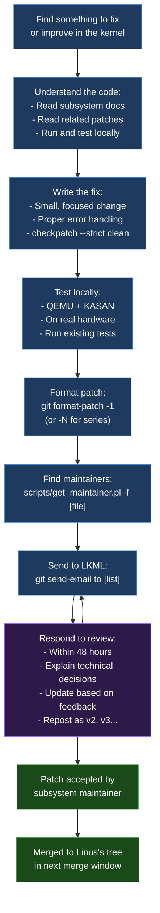

# 11 — Git and Gerrit Mastery

> Git for kernel development + Gerrit/LKML patch workflow. Your 50-patch-train experience documented.

---

## Git Commands You Need Daily

```bash
# === SETUP (one time) ===
git config --global user.name "Ravi Kumar Bokka"
git config --global user.email "brk4embed@gmail.com"
git config --global core.editor "vim"
git config --global format.signoff true    # auto Signed-off-by
git config --global sendemail.smtpserver smtp.gmail.com
git config --global sendemail.smtpencryption tls
git config --global sendemail.smtpserverport 587

# === NAVIGATION ===
git log --oneline -10                      # last 10 commits
git log --oneline --graph --all            # visual branch graph
git log drivers/ufs/ --follow --oneline    # log for specific path
git show HEAD:drivers/ufs/ufshcd.c        # show file at specific commit
git diff HEAD~3..HEAD drivers/ufs/         # diff last 3 commits in path

# === WORKING WITH KERNEL PATCHES ===

# Create a fix branch
git checkout -b fix/ufshcd-null-deref v6.6

# Make your change
vim drivers/ufs/ufshcd.c

# Stage and commit
git add -p drivers/ufs/ufshcd.c   # interactive staging (best practice)
git commit --signoff               # opens editor, add commit message

# Fix commit message
git commit --amend                 # edit last commit

# === THE 50-PATCH TRAIN WORKFLOW ===
# Your Coreboot experience, formalized:

# Rebase your patch series on top of upstream
git fetch origin
git rebase origin/main my-feature-branch

# Interactive rebase — reorder, squash, edit
git rebase -i HEAD~50   # edit last 50 commits

# In the interactive editor:
# pick abc1234 First commit
# pick def5678 Second commit  
# s   ghi9012 Squash this into previous
# r   jkl3456 Reword this commit message
# e   mno7890 Edit this commit (stop and let me amend)

# After rebase — force push to your review branch
# (Never force push to shared branches)
git push --force-with-lease origin my-feature-branch

# === PATCH GENERATION FOR LKML ===

# Single patch
git format-patch -1 HEAD          # generates 0001-*.patch

# Patch series
git format-patch origin/main..HEAD   # all commits since branching from main
git format-patch -10 HEAD            # last 10 commits

# With cover letter (for series > 1 patch)
git format-patch --cover-letter -10 HEAD
# Edit 0000-cover-letter.patch before sending

# === SENDING PATCHES ===

# Find maintainers (critical — send to right people)
./scripts/get_maintainer.pl -f drivers/ufs/ufshcd.c
# Output: maintainer names and mailing lists

# Send single patch
git send-email --to="linux-block@vger.kernel.org" \
               --cc="martin.petersen@oracle.com" \
               --cc="linux-kernel@vger.kernel.org" \
               0001-ufs-fix-null-deref-in-probe.patch

# Send series (patches + cover letter)
git send-email --to="linux-block@vger.kernel.org" \
               --cc="maintainer@example.com" \
               *.patch

# === APPLYING PATCHES ===

# Apply from email (mbox format)
git am < 0001-patch.mbox
git am --3way < series.mbox  # 3-way merge (better for conflicts)

# Apply from LKML (download via lore.kernel.org)
b4 am https://lore.kernel.org/lkml/MESSAGE-ID/

# === BISECT (find which commit introduced a bug) ===
git bisect start
git bisect bad HEAD                  # current commit is broken
git bisect good v6.5                 # v6.5 was known good

# Git will checkout commits, you test each:
# run test → broken:  git bisect bad
# run test → works:   git bisect good
# → git finds the first bad commit

# Automate bisect:
git bisect run ./test_my_driver.sh
```

---

## Kernel Commit Message Format

```
<subsystem>: <short description (50 chars max)>

<blank line>

<body: describe WHY this change is needed, 72 chars per line>

<optionally: describe HOW it works if not obvious>

Fixes: <commit hash> ("<original commit title>")
Link: https://lore.kernel.org/lkml/<message-id>/
Reported-by: <reporter-name> <email>
Signed-off-by: Ravi Kumar Bokka <brk4embed@gmail.com>
Reviewed-by: <reviewer-name> <email>
Tested-by: <tester-name> <email>
```

**Real example from QFPROM driver:**
```
nvmem: qfprom: Add support for Qualcomm SC7180

SC7180 (Snapdragon 7c) has a slightly different QFPROM layout
with the acceleration register at offset 0x4420 instead of the
standard 0x4000 used by earlier SoCs.

Add the SC7180-specific data struct and update the DT binding
with the new compatible string.

Tested on a Lenovo IdeaPad Flex 5i (SC7180-based ChromeOS device)
with the full ChromeOS kernel test suite.

Signed-off-by: Ravi Kumar Bokka <brk4embed@gmail.com>
```

---

## LKML Contribution Workflow



---

## Coreboot / Gerrit Workflow

```bash
# Coreboot uses Gerrit (Google's code review tool)
# URL: https://review.coreboot.org

# Clone with Gerrit hooks
git clone https://review.coreboot.org/coreboot
cd coreboot
git checkout -b my-fix

# Make change + commit
git commit --signoff

# Push for review (to Gerrit, not push to main)
git push origin HEAD:refs/for/main
# Format: refs/for/<branch>

# Push with specific topic
git push origin HEAD:refs/for/main%topic=sc7180-uart

# After review feedback — amend and push new patchset
git commit --amend    # update commit
git push origin HEAD:refs/for/main  # push as patchset 2

# Your review history:
# https://review.coreboot.org/q/owner:brk4embed@gmail.com
```

---

*Related: [12_Open_Source/](../12_Open_Source/) | Your patches: https://lore.kernel.org/lkml/?q=Ravi+Kumar+Bokka | https://review.coreboot.org/q/owner:brk4embed*
