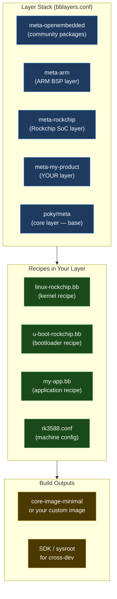

# 28 — Yocto Build Mastery

> From "Yocto confuses me" to "I can create a BSP layer from scratch for any SoC". Buildroot and CMake/Meson included.

---

## Section Structure

```
28_Yocto_Build_Mastery/
├── 01_Yocto_Concepts/
│   ├── 01_Why_Yocto_Exists.md
│   ├── 02_BitBake_Engine.md
│   ├── 03_Layers_And_Recipes.md
│   ├── 04_Variables_And_Syntax.md
│   └── 05_Image_And_SDK.md
├── 02_First_Build/
│   ├── 01_Host_Setup.md
│   ├── 02_Poky_First_Build.md
│   ├── 03_Run_In_QEMU.md
│   └── 04_Add_Package_To_Image.md
├── 03_Recipe_Writing/
│   ├── 01_Recipe_Anatomy.md
│   ├── 02_Autotools_Recipe.md
│   ├── 03_CMake_Recipe.md
│   ├── 04_Kernel_Module_Recipe.md
│   └── 05_Systemd_Service_Recipe.md
├── 04_BSP_Layer_Development/
│   ├── 01_BSP_Layer_Structure.md
│   ├── 02_Machine_Configuration.md
│   ├── 03_Kernel_Configuration.md
│   ├── 04_Bootloader_Recipe.md
│   ├── 05_Device_Tree_In_Yocto.md
│   ├── 06_Custom_Distro_Config.md
│   └── 07_Radxa_5B_Plus_BSP_Lab.md
├── 05_Buildroot/
│   ├── 01_Buildroot_vs_Yocto.md
│   ├── 02_First_Buildroot_Build.md
│   ├── 03_Custom_Package.md
│   └── 04_Buildroot_For_QEMU.md
└── 06_Build_Systems/
    ├── 01_CMake_For_Embedded.md
    ├── 02_Meson_For_Embedded.md
    ├── 03_Autotools_Survival.md
    └── 04_Kbuild_Deep_Dive.md
```

---

## Yocto Quick Start (First Working Build)

### Why Yocto? The 30-Second Answer

```
Problem: Building embedded Linux from scratch for each SoC wastes time.
Solution: Yocto = a build framework that makes Linux distributions reproducible.

Key insight: Yocto doesn't build a specific Linux distro.
             Yocto builds whatever Linux distro YOU define.

Yocto is:
  ✓ A set of tools (BitBake + OpenEmbedded metadata)
  ✓ A layer model for organizing recipes
  ✓ Reproducible (same inputs → same output, always)
  ✓ Customizable (you control everything)

Yocto is NOT:
  ✗ A specific Linux distribution
  ✗ Fast (first build = 1–4 hours)
  ✗ Simple to learn (but worth it)
```

### Mental Model: Layers and Recipes



### Host Setup

```bash
# Ubuntu 22.04/24.04 host
sudo apt update && sudo apt install -y \
  gawk wget git diffstat unzip texinfo gcc build-essential \
  chrpath socat cpio python3 python3-pip python3-pexpect \
  xz-utils debianutils iputils-ping python3-git python3-jinja2 \
  libegl1-mesa libsdl1.2-dev python3-subunit mesa-common-dev \
  zstd liblz4-tool file locales libacl1 \
  lz4

# Fix locale
sudo locale-gen en_US.UTF-8
export LANG=en_US.UTF-8
```

### First Build (QEMU ARM64)

```bash
# Clone Poky (Yocto reference distribution)
git clone git://git.yoctoproject.org/poky.git --branch scarthgap
cd poky

# Initialize build environment
source oe-init-build-env build-qemuarm64
# This creates: build/conf/local.conf and bblayers.conf

# Edit conf/local.conf
# Set the machine
echo 'MACHINE = "qemuarm64"' >> conf/local.conf
# Speed up build (add more CPUs)
echo 'BB_NUMBER_THREADS = "8"' >> conf/local.conf
echo 'PARALLEL_MAKE = "-j8"' >> conf/local.conf
# Use rm_work to save disk (removes work dirs after build)
echo 'INHERIT += "rm_work"' >> conf/local.conf

# Build the minimal image (1–4 hours first time)
bitbake core-image-minimal

# Run in QEMU
runqemu qemuarm64 nographic
# Login: root (no password)
```

---

## Recipe Writing Essentials

### Recipe Anatomy

```bash
# File: recipes-example/hello-driver/hello-driver_1.0.bb

SUMMARY = "Hello world kernel driver"
DESCRIPTION = "Educational kernel module demonstrating recipe writing"
LICENSE = "GPL-2.0-only"
LIC_FILES_CHKSUM = "file://${COMMON_LICENSE_DIR}/GPL-2.0-only;md5=801f80980d171dd6425610833a22dbe6"

# Where to get the source
SRC_URI = "file://hello_driver.c \
           file://Makefile"

# Kernel module recipe — inherit kernel-module class
inherit module

RPROVIDES:${PN} += "kernel-module-hello-driver"
```

```bash
# Variables reference:
# ${PN}     = package name (hello-driver)
# ${PV}     = package version (1.0)
# ${S}      = source directory (where files are unpacked)
# ${D}      = destination directory (where to install files)
# ${WORKDIR} = recipe work directory
# ${B}      = build directory
# ${T}      = temp directory (logs)
# ${STAGING_DIR_TARGET} = sysroot for target (cross-compile headers/libs)
# ${STAGING_BINDIR_CROSS} = cross-compiler tools directory
```

### Kernel Module Recipe (Full Example)

```bash
# File: recipes-kernel/ufshcd-custom/ufshcd-custom_1.0.bb

SUMMARY = "Custom UFS HCD driver patch"
LICENSE = "GPL-2.0-only"
LIC_FILES_CHKSUM = "file://${COMMON_LICENSE_DIR}/GPL-2.0-only;md5=801f80980d171dd6425610833a22dbe6"

# Extend the kernel recipe with an additional patch
FILESEXTRAPATHS:prepend := "${THISDIR}/files:"

SRC_URI += "file://0001-ufs-add-ravi-debug-hooks.patch"

# This is a kernel bbappend approach — add to linux-rockchip.bbappend instead
# For standalone module, use:
inherit module

SRC_URI = "file://ufshcd_custom.c \
           file://Makefile"

EXTRA_OEMAKE = "KERNELDIR=${STAGING_KERNEL_BUILDDIR}"
```

### Machine Configuration (The BSP Core)

```bash
# File: conf/machine/rk3588-custom.conf

#@TYPE: Machine
#@NAME: RK3588 Custom Board
#@DESCRIPTION: Custom board based on RK3588 SoC

require conf/machine/include/arm/armv8-2a/tune-cortexa76.inc

# Machine features
MACHINE_FEATURES = "alsa bluetooth ext2 keyboard pci rtc screen usbgadget usbhost vfat wifi"

# Kernel recipe
PREFERRED_PROVIDER_virtual/kernel = "linux-rockchip"
PREFERRED_VERSION_linux-rockchip = "6.1%"

# Bootloader
PREFERRED_PROVIDER_virtual/bootloader = "u-boot-rockchip"
EXTRA_IMAGEDEPENDS += "u-boot-rockchip"

# Kernel image type
KERNEL_IMAGETYPE = "Image"
KERNEL_DEVICETREE = "rockchip/rk3588-custom-board.dtb"

# U-Boot config
UBOOT_MACHINE = "rk3588_defconfig"
UBOOT_ENTRYPOINT = "0x00480000"
UBOOT_LOADADDRESS = "0x00480000"

# Serial console
SERIAL_CONSOLES = "1500000;ttyS2"

# Image output formats
IMAGE_FSTYPES = "ext4 wic wic.gz"

# WIC image (full disk image with partitions)
WKS_FILE = "rk3588-sdimage.wks"
```

---

## BSP Layer for Radxa 5B+

```bash
# Create BSP layer
bitbake-layers create-layer ../meta-radxa5b-plus
cd ../meta-radxa5b-plus

# Layer structure:
meta-radxa5b-plus/
├── conf/
│   ├── layer.conf
│   └── machine/
│       └── radxa-rock-5b-plus.conf
├── recipes-bsp/
│   ├── u-boot/
│   │   ├── u-boot-rockchip_%.bbappend
│   │   └── files/
│   │       └── rk3588-rock-5b.config
│   └── rockchip-rkbin/
│       └── rockchip-rkbin_git.bb
├── recipes-kernel/
│   ├── linux/
│   │   ├── linux-rockchip_6.1.bb
│   │   └── files/
│   │       ├── defconfig
│   │       └── 0001-rockchip-add-radxa-5b-plus.patch
│   └── linux-firmware/
│       └── linux-firmware-rk3588-npu.bb
└── recipes-graphics/
    └── rockchip-mpp/
        └── rockchip-mpp_git.bb
```

```bash
# conf/layer.conf
BBPATH .= ":${LAYERDIR}"
BBFILES += "${LAYERDIR}/recipes-*/*/*.bb \
             ${LAYERDIR}/recipes-*/*/*.bbappend"
BBFILE_COLLECTIONS += "radxa5b-plus"
BBFILE_PATTERN_radxa5b-plus = "^${LAYERDIR}/"
BBFILE_PRIORITY_radxa5b-plus = "10"
LAYERDEPENDS_radxa5b-plus = "core meta-oe meta-arm meta-rockchip"
LAYERSERIES_COMPAT_radxa5b-plus = "scarthgap"
```

---

## Buildroot vs Yocto

| Aspect | Buildroot | Yocto |
|--------|-----------|-------|
| Learning curve | Low (hours) | High (days/weeks) |
| Build time | Fast (minutes) | Slow (hours) |
| Customization | Limited | Infinite |
| Reproducibility | Good | Excellent |
| Package count | ~2,900 | ~10,000+ |
| SDK generation | Basic | Full |
| Layer system | No | Yes |
| Best for | Simple appliances, demos | Products, complex systems |
| Used by | Hobbyists, prototypes | Automotive, industrial, Yocto-certified |

### Buildroot Quick Start

```bash
git clone https://buildroot.org/downloads/buildroot-2024.02.1.tar.gz
tar xzf buildroot-2024.02.1.tar.gz && cd buildroot-2024.02.1

# Configure for QEMU ARM64
make qemu_aarch64_virt_defconfig

# Customize (optional)
make menuconfig
# Target options: already ARM64
# Toolchain: External toolchain (faster)
# System config: add root password
# Target packages: add your packages

# Build (20-60 minutes)
make -j$(nproc)

# Output:
ls output/images/
# Image  rootfs.ext2  rootfs.tar  start-qemu.sh

# Run
./output/images/start-qemu.sh serial-only
```

---

## CMake for Embedded

```cmake
# CMakeLists.txt — cross-compiled ARM64 project
cmake_minimum_required(VERSION 3.20)
project(EmbeddedApp C)

# Cross-compile toolchain (set via -DCMAKE_TOOLCHAIN_FILE)
# Or inline:
# set(CMAKE_C_COMPILER aarch64-linux-gnu-gcc)
# set(CMAKE_SYSTEM_NAME Linux)
# set(CMAKE_SYSTEM_PROCESSOR aarch64)

set(CMAKE_C_STANDARD 11)
set(CMAKE_C_STANDARD_REQUIRED ON)

# Compiler flags for embedded
set(CMAKE_C_FLAGS "${CMAKE_C_FLAGS} -Wall -Wextra -Werror")
set(CMAKE_C_FLAGS_RELEASE "-O2 -DNDEBUG -fstack-protector-strong")
set(CMAKE_C_FLAGS_DEBUG "-Og -g3 -fsanitize=address,undefined")

# Find required packages
find_package(Threads REQUIRED)

# Application
add_executable(embedded_app
    src/main.c
    src/uart.c
    src/sensor.c
)

target_include_directories(embedded_app PRIVATE
    ${CMAKE_CURRENT_SOURCE_DIR}/include
)

target_link_libraries(embedded_app PRIVATE
    Threads::Threads
)

# Install
install(TARGETS embedded_app DESTINATION bin)
```

```bash
# Cross-compile
mkdir build-arm64 && cd build-arm64
cmake .. \
  -DCMAKE_TOOLCHAIN_FILE=../cmake/arm64-linux-gnu.cmake \
  -DCMAKE_BUILD_TYPE=Release \
  -DCMAKE_INSTALL_PREFIX=/usr

make -j$(nproc)
make install DESTDIR=$(pwd)/staging
```

```cmake
# cmake/arm64-linux-gnu.cmake — toolchain file
set(CMAKE_SYSTEM_NAME Linux)
set(CMAKE_SYSTEM_PROCESSOR aarch64)
set(TOOLCHAIN_PREFIX aarch64-linux-gnu)

set(CMAKE_C_COMPILER   ${TOOLCHAIN_PREFIX}-gcc)
set(CMAKE_CXX_COMPILER ${TOOLCHAIN_PREFIX}-g++)
set(CMAKE_AR           ${TOOLCHAIN_PREFIX}-ar)
set(CMAKE_STRIP        ${TOOLCHAIN_PREFIX}-strip)

set(CMAKE_FIND_ROOT_PATH_MODE_PROGRAM NEVER)
set(CMAKE_FIND_ROOT_PATH_MODE_LIBRARY ONLY)
set(CMAKE_FIND_ROOT_PATH_MODE_INCLUDE ONLY)
```

---

## Interview Questions

**Beginner:**
- What is Yocto and why is it used for embedded Linux?
- What is a BitBake recipe?
- What is the difference between a layer and a recipe?

**Intermediate:**
- Explain the difference between `MACHINE_FEATURES`, `DISTRO_FEATURES`, and `IMAGE_FEATURES` in Yocto.
- How would you add a kernel configuration option (e.g., `CONFIG_UFS`) to a Yocto build?
- When would you choose Buildroot over Yocto for a project?

**Advanced:**
- How does BitBake's dependency resolution work? What is the difference between `DEPENDS` and `RDEPENDS`?
- Explain how to create a BSP layer for a new board. What files are required at minimum?
- How would you patch the Linux kernel source in Yocto? What's the difference between `SRC_URI` patches and `bbappend` approaches?

**Expert:**
- Design a Yocto-based CI/CD pipeline for an embedded product with A/B partition updates (OSTree or SWUpdate).
- How would you create a reproducible SDK for your team that includes custom kernel headers, Rockchip MPP libraries, and RKNN toolkit?
- Explain `sstate-cache` and how it enables incremental builds. What invalidates an sstate entry?

---

*Related: [04_Embedded_Linux/](../04_Embedded_Linux/) | [29_QEMU_Embedded_AI_Labs/](../29_QEMU_Embedded_AI_Labs/)*
