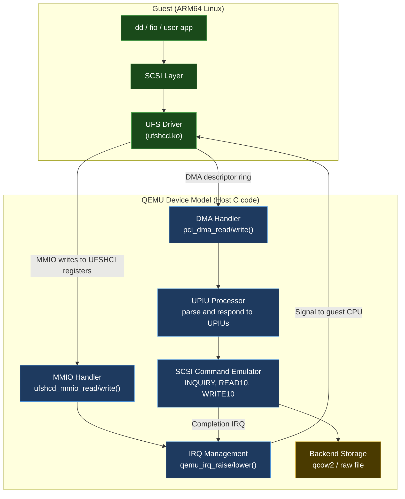

# 29 — QEMU Embedded AI Labs

> **Your virtual development platform.** Build complete embedded AI systems in QEMU before touching real hardware. Includes your DW-UFS 4.0 device model as a case study.

---

## Section Structure

```
29_QEMU_Embedded_AI_Labs/
├── 01_BSP_From_Scratch_Manual/         ← Start here
│   ├── 01_Toolchain_Setup.md
│   ├── 02_Build_U_Boot_For_QEMU.md
│   ├── 03_Build_Linux_Kernel.md
│   ├── 04_Build_Minimal_RootFS.md
│   ├── 05_First_Boot_And_Debug.md
│   └── 06_Add_Device_Driver.md
├── 02_AI_Frameworks_On_QEMU/           ← Run AI on ARM64 QEMU
│   ├── 01_TFLite_On_QEMU.md
│   ├── 02_ONNX_Runtime.md
│   ├── 03_PyTorch_ARM64.md
│   └── 04_Performance_Benchmarks.md
├── 03_LLMs_On_QEMU/                    ← Run LLMs in QEMU
│   ├── 01_llama_cpp_On_QEMU.md
│   ├── 02_Ollama_On_QEMU.md
│   ├── 03_LLM_As_Debug_Assistant.md
│   └── 04_LLM_Kernel_Log_Analyzer.md
├── 04_Custom_NPU_Device_Model/         ← YOUR UFS experience applied
│   ├── 01_QEMU_Device_Model_Concepts.md
│   ├── 02_Minimal_MMIO_Device.md
│   ├── 03_DMA_Device_Model.md
│   ├── 04_NPU_Device_Model_Design.md
│   └── 05_UFS_Model_Lessons_Applied.md ← Case study: your DW-UFS 4.0
└── 05_Embedded_AI_Projects/
    ├── Project_01_Edge_Inference_QEMU.md
    ├── Project_02_AI_Sensor_Fusion.md
    ├── Project_03_Automated_BSP_Testing.md
    └── Project_04_LLM_Log_Analyzer.md
```

---

## Why QEMU for Embedded AI

```
Traditional embedded development:
  Code → Cross-compile → Flash → Boot → Test → Debug → Repeat
  Time per iteration: 5–15 minutes
  Hardware required: Yes
  Parallel testing: Impossible

QEMU-first development:
  Code → Compile → QEMU → Test → Debug → Iterate
  Time per iteration: 30–60 seconds
  Hardware required: No (until final validation)
  Parallel testing: Run 10 QEMU instances simultaneously
```

### What QEMU Can and Can't Simulate

| Can Simulate | Cannot Simulate |
|-------------|----------------|
| CPU (Cortex-A76, A55, A53) | Exact clock timing |
| Memory (arbitrary size) | DDR training |
| PCI, USB, UART, I2C, SPI | Analog peripherals |
| VirtIO devices | Real NPU performance |
| Custom MMIO devices (you write them) | PCB parasitics |
| Interrupt controllers (GIC) | Power consumption |
| IOMMU, TrustZone EL | Physical EMI/ESD |

---

## Lab 1: Complete BSP Build from Scratch

### Environment Setup

```bash
# Create workspace
mkdir -p ~/qemu-embedded-lab/{toolchain,u-boot,linux,busybox,rootfs,images}
cd ~/qemu-embedded-lab

# ARM64 cross-compiler
sudo apt install -y gcc-aarch64-linux-gnu g++-aarch64-linux-gnu
export CROSS=aarch64-linux-gnu-
export ARCH=arm64

# QEMU
sudo apt install -y qemu-system-aarch64
qemu-system-aarch64 --version  # should be 6.x or 7.x+

# Build tools
sudo apt install -y \
  bc flex bison libssl-dev libncurses-dev \
  device-tree-compiler fdtdump cpio \
  libglib2.0-dev libfdt-dev libpixman-1-dev
```

### Build U-Boot for QEMU

```bash
cd ~/qemu-embedded-lab

# Clone U-Boot
git clone https://source.denx.de/u-boot/u-boot.git --depth=1 --branch v2024.01
cd u-boot

# Configure for QEMU ARM64
make ARCH=arm64 CROSS_COMPILE=$CROSS qemu_arm64_defconfig

# Enable useful debug features (optional)
make ARCH=arm64 CROSS_COMPILE=$CROSS menuconfig
# Enable: Boot options → Autoboot → with delay of 3s
# Enable: Device Drivers → Network device → enable networking

# Build
make ARCH=arm64 CROSS_COMPILE=$CROSS -j$(nproc) 2>&1 | tail -20

# Test immediately
qemu-system-aarch64 \
  -machine virt \
  -cpu cortex-a57 \
  -m 1G \
  -bios u-boot.bin \
  -nographic \
  -serial mon:stdio

# You should see U-Boot prompt:
# => help
# => version
# Ctrl-A X to exit
```

### Build Linux Kernel

```bash
cd ~/qemu-embedded-lab

git clone https://git.kernel.org/pub/scm/linux/kernel/git/stable/linux.git \
  --depth=1 --branch v6.6.30 linux
cd linux

# Configure for ARM64 QEMU
make ARCH=arm64 CROSS_COMPILE=$CROSS defconfig

# Enable additional features via menuconfig
make ARCH=arm64 CROSS_COMPILE=$CROSS menuconfig
# File systems → 9P → 9P Network filesystem (useful for host folder sharing)
# Virtualization → enable KVM guest support  
# Device Drivers → Virtio → enable all virtio
# Kernel hacking → KASAN (for memory debugging)

# Build
make ARCH=arm64 CROSS_COMPILE=$CROSS Image -j$(nproc)
# Output: arch/arm64/boot/Image (about 20MB)
echo "Kernel built: $(ls -lh arch/arm64/boot/Image)"
```

### Build Minimal RootFS

```bash
cd ~/qemu-embedded-lab

wget https://busybox.net/downloads/busybox-1.36.1.tar.bz2
tar xjf busybox-1.36.1.tar.bz2
cd busybox-1.36.1

make ARCH=arm64 CROSS_COMPILE=$CROSS defconfig
# Enable static build:
make ARCH=arm64 CROSS_COMPILE=$CROSS menuconfig
# Settings → Build static binary (no shared libs) → Y

make ARCH=arm64 CROSS_COMPILE=$CROSS -j$(nproc)
make ARCH=arm64 CROSS_COMPILE=$CROSS install
# Installs to _install/

cd ~/qemu-embedded-lab
mkdir -p rootfs/{bin,dev,etc,lib,proc,run,sys,tmp,usr/{bin,lib,sbin},var/log}

# Copy BusyBox
cp -a busybox-1.36.1/_install/. rootfs/

# Create device nodes
sudo mknod -m 622 rootfs/dev/console c 5 1
sudo mknod -m 666 rootfs/dev/null c 1 3
sudo mknod -m 666 rootfs/dev/zero c 1 5
sudo mknod -m 444 rootfs/dev/urandom c 1 9

# Create init
cat > rootfs/etc/inittab << 'EOF'
::sysinit:/etc/init.d/rcS
::respawn:/sbin/getty -L ttyAMA0 115200 vt100
::shutdown:/bin/umount -a -r
EOF

mkdir -p rootfs/etc/init.d
cat > rootfs/etc/init.d/rcS << 'EOF'
#!/bin/sh
mount -t proc proc /proc
mount -t sysfs sysfs /sys
mount -t devtmpfs devtmpfs /dev
echo "=== Embedded Linux Boot Complete ==="
echo "Board: QEMU virt, CPU: Cortex-A76 (emulated)"
EOF
chmod +x rootfs/etc/init.d/rcS

# Build initramfs
cd rootfs
find . | cpio -H newc -o 2>/dev/null | gzip > ../initramfs.cpio.gz
cd ..
ls -lh initramfs.cpio.gz
```

### First Complete Boot

```bash
cd ~/qemu-embedded-lab

qemu-system-aarch64 \
  -machine virt,gic-version=3 \
  -cpu cortex-a76 \
  -smp 4 \
  -m 4G \
  -kernel linux/arch/arm64/boot/Image \
  -initrd initramfs.cpio.gz \
  -append "console=ttyAMA0 rdinit=/sbin/init loglevel=7" \
  -nographic \
  -no-reboot

# Expected output:
# [    0.000000] Booting Linux on physical CPU 0x0000000000 [0x410fd034]
# [    0.000000] Linux version 6.6.30 (...)
# ...
# === Embedded Linux Boot Complete ===
# / # _
```

---

## Running LLMs Inside QEMU

```bash
# Inside the QEMU guest (or on Radxa 5B+)

# Step 1: Get llama.cpp (inside QEMU or cross-compile)
# From QEMU guest (if you have network in QEMU):
# Add -netdev user,id=net0 -device virtio-net-pci,netdev=net0 to QEMU args

# Cross-compile llama.cpp for ARM64
cd ~/qemu-embedded-lab
git clone https://github.com/ggerganov/llama.cpp
cd llama.cpp

# Cross-compile
cmake -B build-arm64 \
  -DCMAKE_TOOLCHAIN_FILE=../cmake/arm64-linux-gnu.cmake \
  -DCMAKE_BUILD_TYPE=Release \
  -DLLAMA_NATIVE=OFF

cmake --build build-arm64 --config Release -j$(nproc)

# Copy to QEMU via 9P (host folder sharing) or virtio-blk
# Add to QEMU: -virtfs local,path=/home/user/share,mount_tag=host0,security_model=passthrough,id=host0
# In QEMU: mount -t 9p -o trans=virtio host0 /mnt/host

# Run inside QEMU (with a tiny model)
/mnt/host/llama-cli -m /mnt/host/tinyllama-1.1b-q4.gguf \
  -p "Explain why DDR training fails on a new board design" \
  -n 200
```

---

## Custom QEMU Device Model (UFS Case Study)

Based on your DW-UFS 4.0 work, here's how to build a custom device model:

### QEMU Device Model Architecture



### Minimal MMIO Device (Template)

```c
/* hw/misc/ravi_demo_device.c
 * A minimal QEMU MMIO device — template for custom device models
 * Based on lessons from DW-UFS 4.0 QEMU modeling
 */
#include "qemu/osdep.h"
#include "hw/sysbus.h"
#include "hw/register.h"
#include "qemu/log.h"
#include "qemu/module.h"

#define TYPE_RAVI_DEMO "ravi-demo-device"
OBJECT_DECLARE_SIMPLE_TYPE(RaviDemoState, RAVI_DEMO)

/* Register offsets */
#define REG_STATUS       0x00
#define REG_CONTROL      0x04
#define REG_DATA         0x08
#define REG_IRQ_STATUS   0x0C
#define REG_IRQ_ENABLE   0x10

/* STATUS register bits */
#define STATUS_READY     BIT(0)
#define STATUS_BUSY      BIT(1)
#define STATUS_ERROR     BIT(2)

#define DEVICE_MMIO_SIZE  0x1000  /* 4KB register space */

struct RaviDemoState {
    SysBusDevice parent_obj;
    MemoryRegion iomem;
    qemu_irq irq;
    
    /* Register state */
    uint32_t status;
    uint32_t control;
    uint32_t data;
    uint32_t irq_status;
    uint32_t irq_enable;
};

static uint64_t ravi_demo_read(void *opaque, hwaddr addr, unsigned size)
{
    RaviDemoState *s = RAVI_DEMO(opaque);
    uint32_t val = 0;
    
    switch (addr) {
    case REG_STATUS:
        val = s->status;
        break;
    case REG_CONTROL:
        val = s->control;
        break;
    case REG_DATA:
        val = s->data;
        break;
    case REG_IRQ_STATUS:
        val = s->irq_status;
        break;
    case REG_IRQ_ENABLE:
        val = s->irq_enable;
        break;
    default:
        qemu_log_mask(LOG_GUEST_ERROR,
                      "ravi_demo: read from unknown offset 0x%lx\n", addr);
    }
    
    qemu_log_mask(LOG_UNIMP, "ravi_demo: read[0x%lx] = 0x%x\n", addr, val);
    return val;
}

static void ravi_demo_write(void *opaque, hwaddr addr, uint64_t val, unsigned size)
{
    RaviDemoState *s = RAVI_DEMO(opaque);
    
    qemu_log_mask(LOG_UNIMP, "ravi_demo: write[0x%lx] = 0x%lx\n", addr, val);
    
    switch (addr) {
    case REG_CONTROL:
        s->control = val;
        /* Simulate: writing 1 to bit 0 triggers operation */
        if (val & BIT(0)) {
            s->status = STATUS_BUSY;
            /* In real device: would process s->data here */
            /* For demo: immediately complete */
            s->status = STATUS_READY;
            s->irq_status |= BIT(0);  /* completion IRQ */
            if (s->irq_enable & BIT(0)) {
                qemu_irq_raise(s->irq);
            }
        }
        break;
    case REG_DATA:
        s->data = val;
        break;
    case REG_IRQ_STATUS:
        /* W1C — write 1 to clear */
        s->irq_status &= ~val;
        if (!s->irq_status) {
            qemu_irq_lower(s->irq);
        }
        break;
    case REG_IRQ_ENABLE:
        s->irq_enable = val;
        break;
    default:
        qemu_log_mask(LOG_GUEST_ERROR,
                      "ravi_demo: write to unknown offset 0x%lx = 0x%lx\n",
                      addr, val);
    }
}

static const MemoryRegionOps ravi_demo_ops = {
    .read  = ravi_demo_read,
    .write = ravi_demo_write,
    .endianness = DEVICE_NATIVE_ENDIAN,
    .valid = {
        .min_access_size = 4,
        .max_access_size = 4,
    },
};

static void ravi_demo_realize(DeviceState *dev, Error **errp)
{
    RaviDemoState *s = RAVI_DEMO(dev);
    SysBusDevice *sbd = SYS_BUS_DEVICE(dev);
    
    memory_region_init_io(&s->iomem, OBJECT(s), &ravi_demo_ops, s,
                          "ravi-demo", DEVICE_MMIO_SIZE);
    sysbus_init_mmio(sbd, &s->iomem);
    sysbus_init_irq(sbd, &s->irq);
    
    /* Initialize register state */
    s->status = STATUS_READY;
    s->control = 0;
    s->data = 0;
    s->irq_status = 0;
    s->irq_enable = 0;
}

static void ravi_demo_reset(DeviceState *dev)
{
    RaviDemoState *s = RAVI_DEMO(dev);
    s->status = STATUS_READY;
    s->control = 0;
    s->irq_status = 0;
    s->irq_enable = 0;
    qemu_irq_lower(s->irq);
}

static void ravi_demo_class_init(ObjectClass *oc, void *data)
{
    DeviceClass *dc = DEVICE_CLASS(oc);
    dc->realize = ravi_demo_realize;
    dc->reset   = ravi_demo_reset;
    dc->desc    = "Ravi Demo MMIO Device";
    set_bit(DEVICE_CATEGORY_MISC, dc->categories);
}

static const TypeInfo ravi_demo_type_info = {
    .name          = TYPE_RAVI_DEMO,
    .parent        = TYPE_SYS_BUS_DEVICE,
    .instance_size = sizeof(RaviDemoState),
    .class_init    = ravi_demo_class_init,
};

static void ravi_demo_register_types(void)
{
    type_register_static(&ravi_demo_type_info);
}
type_init(ravi_demo_register_types)
```

---

## Project 4: LLM-Powered Kernel Log Analyzer

```python
#!/usr/bin/env python3
"""
LLM Kernel Log Analyzer
Based on your AI Pre-Silicon Validation Platform experience.

Input:  dmesg output (file or stdin)
Output: Structured analysis with severity, root cause, debug steps

Usage: python3 log_analyzer.py [dmesg.log] [--model claude|local]
"""

import sys
import re
import json
import argparse
from pathlib import Path

# Requires: pip install anthropic (for Claude) or requests (for local Ollama)

ANALYSIS_PROMPT = """You are an expert embedded Linux kernel engineer with 15+ years experience.
Analyze this kernel log and provide:

1. **Executive Summary** (2-3 sentences): What went wrong?
2. **Severity**: CRITICAL / HIGH / MEDIUM / LOW
3. **Error Classification**: (OOM / NULL_PTR / IRQ / DMA / DRIVER_PROBE / BOOT_FAIL / NETWORK / STORAGE / OTHER)
4. **Root Cause Hypothesis**: Most likely cause (be specific)
5. **Debug Steps** (numbered list): Exact commands to run next
6. **Related Kernel Subsystem**: Which subsystem/driver is involved
7. **Similar Known Issues**: Any known bugs this resembles

Kernel log:
{log_content}

Respond in JSON format matching the structure above."""


def extract_errors(log_content: str) -> list[str]:
    """Extract error/warning lines from kernel log."""
    error_patterns = [
        r'.*BUG:.*',
        r'.*WARN:.*', 
        r'.*ERROR:.*',
        r'.*error:.*',
        r'.*Kernel panic.*',
        r'.*Unable to handle.*',
        r'.*Oops:.*',
        r'.*Call trace:.*',
        r'.*\[ cut here \].*',
    ]
    
    errors = []
    for line in log_content.split('\n'):
        for pattern in error_patterns:
            if re.match(pattern, line, re.IGNORECASE):
                errors.append(line)
                break
    return errors


def analyze_with_claude(log_content: str) -> dict:
    """Analyze using Claude API."""
    import anthropic
    
    client = anthropic.Anthropic()  # uses ANTHROPIC_API_KEY env var
    
    message = client.messages.create(
        model="claude-3-5-sonnet-20241022",
        max_tokens=2048,
        messages=[{
            "role": "user",
            "content": ANALYSIS_PROMPT.format(log_content=log_content[:8000])
        }]
    )
    
    response_text = message.content[0].text
    # Parse JSON from response
    try:
        return json.loads(response_text)
    except json.JSONDecodeError:
        return {"raw_analysis": response_text}


def analyze_with_ollama(log_content: str, model: str = "codellama") -> dict:
    """Analyze using local Ollama."""
    import requests
    
    response = requests.post(
        "http://localhost:11434/api/generate",
        json={
            "model": model,
            "prompt": ANALYSIS_PROMPT.format(log_content=log_content[:4000]),
            "stream": False
        },
        timeout=120
    )
    
    if response.status_code == 200:
        result = response.json()
        try:
            return json.loads(result["response"])
        except json.JSONDecodeError:
            return {"raw_analysis": result["response"]}
    else:
        return {"error": f"Ollama request failed: {response.status_code}"}


def format_analysis(analysis: dict) -> str:
    """Format analysis for display."""
    if "raw_analysis" in analysis:
        return analysis["raw_analysis"]
    
    output = []
    output.append("=" * 60)
    output.append("KERNEL LOG ANALYSIS")
    output.append("=" * 60)
    
    if "Executive Summary" in analysis:
        output.append(f"\n📋 SUMMARY: {analysis['Executive Summary']}")
    
    if "Severity" in analysis:
        severity_emoji = {"CRITICAL": "🔴", "HIGH": "🟠", "MEDIUM": "🟡", "LOW": "🟢"}
        emoji = severity_emoji.get(analysis["Severity"], "⚪")
        output.append(f"\n{emoji} SEVERITY: {analysis['Severity']}")
    
    if "Root Cause Hypothesis" in analysis:
        output.append(f"\n🔍 ROOT CAUSE: {analysis['Root Cause Hypothesis']}")
    
    if "Debug Steps" in analysis:
        output.append("\n🛠️  DEBUG STEPS:")
        for i, step in enumerate(analysis["Debug Steps"], 1):
            output.append(f"   {i}. {step}")
    
    output.append("=" * 60)
    return "\n".join(output)


def main():
    parser = argparse.ArgumentParser(description="AI-powered kernel log analyzer")
    parser.add_argument("logfile", nargs="?", help="Kernel log file (default: stdin)")
    parser.add_argument("--model", choices=["claude", "local"], default="local",
                        help="AI model to use")
    parser.add_argument("--ollama-model", default="codellama",
                        help="Local Ollama model name")
    args = parser.parse_args()
    
    # Read log
    if args.logfile:
        log_content = Path(args.logfile).read_text()
    else:
        print("Reading from stdin... (Ctrl+D when done)")
        log_content = sys.stdin.read()
    
    print(f"Analyzing {len(log_content)} bytes of kernel log...")
    
    # Extract errors for context
    errors = extract_errors(log_content)
    print(f"Found {len(errors)} error/warning lines")
    
    # Analyze
    if args.model == "claude":
        analysis = analyze_with_claude(log_content)
    else:
        analysis = analyze_with_ollama(log_content, args.ollama_model)
    
    print(format_analysis(analysis))
    
    # Save analysis
    output_file = "analysis_result.json"
    with open(output_file, "w") as f:
        json.dump(analysis, f, indent=2)
    print(f"\nFull analysis saved to {output_file}")


if __name__ == "__main__":
    main()
```

```bash
# Usage examples:
python3 log_analyzer.py dmesg.log --model local
dmesg | python3 log_analyzer.py --model claude
python3 log_analyzer.py boot_failure.log --model local --ollama-model deepseek-coder
```

---

## Interview Questions

**Beginner:**
- What is QEMU and why is it useful for embedded development?
- What is the difference between `qemu-system-aarch64` and `qemu-user`?
- What is a QEMU device model?

**Intermediate:**
- How would you debug a driver in QEMU using GDB?
- Explain how a QEMU MMIO device model works — how does a guest `writel()` call reach your C function?
- What are the advantages of QEMU-first development for a new SoC?

**Advanced:**
- Design a QEMU device model for a DMA-capable peripheral. What callbacks are needed?
- How does QEMU handle DMA from a device model? What function would you call to read guest memory?
- Describe the lessons you learned from building the DW-UFS 4.0 QEMU model. What was the hardest part?

**Expert:**
- Design a QEMU-based pre-silicon validation platform for a custom NPU. How would you model the NPU firmware interface, DMA descriptor ring, and interrupt delivery?
- How would you implement a save/restore (snapshot) feature for your QEMU device model?
- Compare QEMU, ARM FVP, and Renode for embedded AI pre-silicon validation. When would you choose each?

---

*Related: [17_QEMU_Virtualization/](../17_QEMU_Virtualization/) | [30_Virtual_Platforms/](../30_Virtual_Platforms/) | [19_AI_Agents/](../19_AI_Agents/)*
