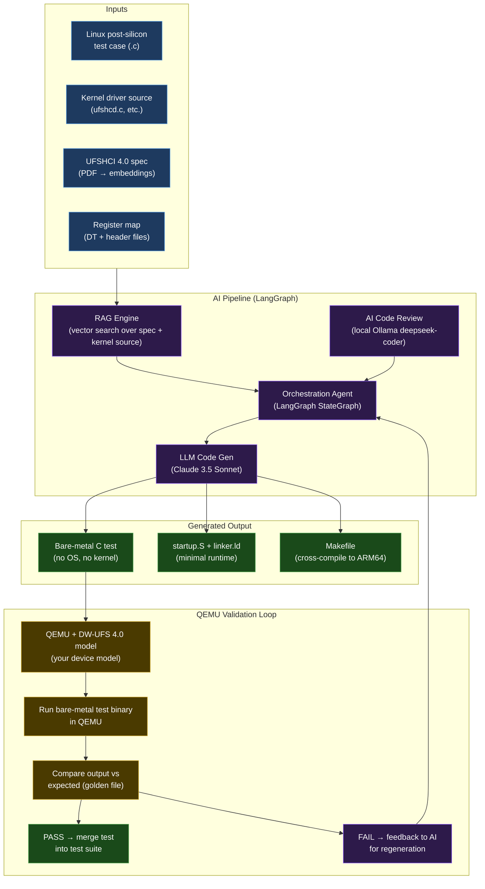

# 30 — Virtual Platforms & Pre-Silicon Validation

> QEMU + ARM FVP + Renode + pKVM + your AI Pre-Silicon Validation Platform

---

## What Are Virtual Platforms?

```
Virtual Platform = Software model of hardware that runs real software

Why they exist:
  1. Silicon isn't available yet (pre-silicon development)
  2. Hardware is expensive to provision for all developers
  3. Debugging on real hardware is slow (no pause/step/rewind)
  4. CI/CD requires headless automation (no physical board needed)
  5. Safety-critical validation (test scenarios impossible on real HW)

Your current project (AI Pre-Silicon Validation) = cutting-edge usage
```

---

## Platform Comparison

| Platform | Best For | Cost | Hardware Models | Your Experience |
|---------|---------|------|----------------|----------------|
| **QEMU** | Linux BSP dev, driver testing | Free | Generic ARM, RISC-V, x86 | DW-UFS 4.0 model |
| **ARM FVP** | ARM IP validation, TrustZone | Free (AEM) to $$$ (licensable) | Exact ARM IP models | Related to QTEE work |
| **Renode** | IoT, bare-metal, Zephyr | Free/Open Source | Many embedded MCUs | Learn this |
| **pKVM** | Android/Linux hypervisor | Free (in-kernel) | Based on QEMU | Understand this |
| **Synopsys/Cadence** | Pre-silicon SoC | Very expensive | Full SoC RTL simulation | Conceptual |
| **Simics** | Automotive, aerospace | Enterprise $$ | Complete systems | Conceptual |

---

## ARM Fixed Virtual Platform (FVP)

### What FVP Provides

```
FVP = Cycle-accurate (or fast) simulation of ARM IP blocks:
  - Cortex-A76/A78/X1/A55 cycle model
  - GIC-600 (interrupt controller)
  - CCN-512/CMN-700 (cache coherent network)
  - TrustZone, SVE, MTE (memory tagging)
  - ARM Mali GPU model

Why use FVP over QEMU:
  ✓ Exact ARM IP behavior (QEMU approximates)
  ✓ Required for ARM architecture compliance testing
  ✓ TrustZone behavior is exact (your QTEE work!)
  ✓ AArch64 architecture test suite runs on FVP
  ✗ Slower than QEMU (cycle-accurate costs cycles)
  ✗ Some models require license from ARM
```

### Getting FVP

```bash
# AEM (Architecture Envelope Models) — FREE
# Download from ARM developer portal:
# https://developer.arm.com/downloads/-/arm-ecosystem-fvps

# After download:
tar xf FVP_Base_RevC-2xAEMvA_11.22_15_Linux64.tgz
cd FVP_Base_RevC-2xAEMvA_11.22_15_Linux64
sudo ./FVP_Base_RevC-2xAEMvA.sh --no-interactive

# Run with your Linux + ATF setup:
FVP_Base_RevC-2xAEMvA \
  -C bp.secureflashloader.fname=bl1.bin \
  -C bp.flashloader0.fname=fip.bin \
  -C bp.pl011_uart0.out_file=uart0.log \
  -C bp.virtio_net.enabled=1 \
  -C cluster0.NUM_CORES=4 \
  -C cluster1.NUM_CORES=4 \
  --stat

# Where fip.bin = BL2 + BL31 (ATF) + BL32 (OP-TEE) + BL33 (U-Boot)
# Exactly the same as your Coreboot/ATF work, just on FVP
```

### TrustZone Testing on FVP (Your QTEE Knowledge Applied)

```bash
# FVP perfectly models TrustZone EL3/EL1-S/EL1-NS behavior
# This is where your QTEE experience is directly applicable:

# Run ATF (BL31) + OP-TEE + Linux on FVP:
FVP_Base_RevC-2xAEMvA \
  -C bp.secureflashloader.fname=bl1.bin \
  -C bp.flashloader0.fname=fip.bin \
  # FIP contains: BL2 + BL31 + OP-TEE + U-Boot
  --data cluster0.cpu0=Image@0x80080000 \  # kernel
  --data cluster0.cpu0=rk.dtb@0x82000000 \ # DTB

# Test TrustZone world switch:
# Normal world (Linux) makes SMC call → EL3 (ATF BL31) → EL1-S (OP-TEE) → back
# FVP models this exactly — you can debug the world switch timing
```

---

## pKVM (Protected KVM)

### What pKVM Is

```
pKVM = A mode of KVM (Linux's hypervisor) where:
  - The hypervisor is "protected" from the host OS
  - Virtual machines get hardware-isolated memory
  - Host Linux kernel cannot read guest VM memory
  - Based on PKVM patches merged into Android kernel

Architecture on ARM64:
  ┌──────────────────────────────────────────────┐
  │ EL2 — KVM/pKVM hypervisor                   │
  │  Protected from EL1-NS (even from host Linux) │
  └──────────────────────────────────────────────┘
  EL1-NS (host Linux)  │  EL1-NS (guest VM)
  Normal Linux kernel   │  Isolated guest kernel
                        │  Cannot be read by host

Use cases:
  - Android protected virtual machines (Microdroid)
  - Confidential computing on ARM
  - Secure workload isolation (AI model protection)
```

### pKVM Setup (Experimental)

```bash
# pKVM is in Android kernel (AOSP kernel), not mainline Linux
git clone https://android.googlesource.com/kernel/common \
  --branch android-mainline

# Enable pKVM:
CONFIG_KVM=y
CONFIG_KVM_ARM_HOST=y
CONFIG_PROTECTED_NVHE_STACKTRACE=y

# pKVM uses EL2 for the hypervisor (vs standard KVM which uses EL1)
# NVHE = Non-VHE mode (hypervisor at EL2, not EL1)

# Test with KVM unit tests:
git clone https://gitlab.com/kvm-unit-tests/kvm-unit-tests
cd kvm-unit-tests
./configure --cross-prefix=aarch64-linux-gnu-
make -j$(nproc)
./run_tests.sh  # runs KVM conformance tests
```

---

## Your AI Pre-Silicon Validation Platform (Architecture)

Based on your current project at Eximietas Design:



### Key Technical Components

```python
# State machine (LangGraph) for the validation pipeline
from langgraph.graph import StateGraph, END
from typing import TypedDict, Annotated

class ValidationState(TypedDict):
    # Input
    linux_test_path: str
    test_content: str
    
    # Context (from RAG)
    spec_context: str
    kernel_context: str
    
    # Generated
    bare_metal_code: str
    compilation_result: str
    qemu_output: str
    
    # Status
    iteration: int
    status: str  # generating | compiling | running | passed | failed

def rag_context_node(state: ValidationState) -> ValidationState:
    """Retrieve relevant spec sections and kernel patterns via RAG."""
    # Search vector store for: register names, UPIU patterns, interrupt handling
    ...
    return state

def generate_test_node(state: ValidationState) -> ValidationState:
    """Generate bare-metal C test using LLM."""
    prompt = f"""
    Convert this Linux kernel UFS test to bare-metal C (no OS):
    
    Test file: {state['test_content']}
    
    Relevant spec sections:
    {state['spec_context']}
    
    Kernel patterns to translate:
    {state['kernel_context']}
    
    Requirements:
    - No kernel headers (no linux/)
    - Use MMIO direct register access
    - Handle interrupts via polling (no IRQ framework)
    - Print PASS/FAIL to UART at 0xfe650000
    """
    state['bare_metal_code'] = call_claude(prompt)
    return state

def validate_in_qemu_node(state: ValidationState) -> ValidationState:
    """Compile and run in QEMU, capture output."""
    # 1. Write code to temp dir
    # 2. Cross-compile: aarch64-linux-gnu-gcc -nostdlib ...
    # 3. Run: qemu-system-aarch64 -M virt -bios test.bin -nographic
    # 4. Capture UART output
    # 5. Compare with expected
    ...
    return state

# Build the graph
graph = StateGraph(ValidationState)
graph.add_node("rag_context", rag_context_node)
graph.add_node("generate_test", generate_test_node)
graph.add_node("validate_qemu", validate_in_qemu_node)

graph.add_edge("rag_context", "generate_test")
graph.add_edge("generate_test", "validate_qemu")
graph.add_conditional_edges(
    "validate_qemu",
    lambda s: "passed" if s["status"] == "passed" else "retry",
    {"passed": END, "retry": "generate_test"}
)

app = graph.compile()
```

---

## Interview Questions

**Beginner:**
- What is a virtual platform? Give 2 examples.
- When would you use QEMU instead of real hardware?
- What is pKVM and how does it differ from regular KVM?

**Intermediate:**
- Compare QEMU and ARM FVP for pre-silicon validation. When is FVP preferred?
- What is the FIP (Firmware Image Package) format and what does it contain?
- How does pKVM achieve memory isolation between guest and host?

**Advanced:**
- Design a pre-silicon validation pipeline for a new UFS 5.0 controller. What would you model first, and why?
- Explain how your DW-UFS 4.0 QEMU model handles DMA from the Linux driver perspective.
- What are the limitations of software simulation that mean bugs can survive pre-silicon validation?

**Expert:**
- Design a hybrid validation strategy: QEMU for functional tests, FVP for TrustZone tests, real hardware for timing-critical tests. What automation glues them together?
- How would you model a non-coherent DMA device in QEMU? What API calls are involved?
- Explain ARM CCA (Confidential Compute Architecture) and how it extends pKVM concepts.

---

*Related: [17_QEMU_Virtualization/](../17_QEMU_Virtualization/) | [29_QEMU_Embedded_AI_Labs/](../29_QEMU_Embedded_AI_Labs/) | [19_AI_Agents/](../19_AI_Agents/)*
