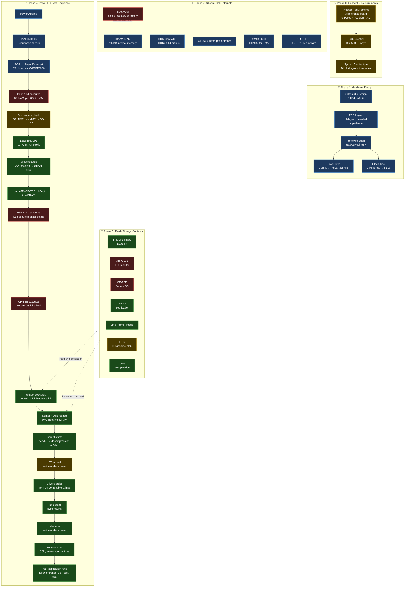

# 01 — From Idea to Running System

> The complete mental model. Read this once a month until you can draw it from memory.

---

## Level 1: The 5-Year-Old Explanation

Imagine you have a toy robot. Before it can do anything, you need to:
1. Put batteries in (power)
2. It wakes up and checks "what kind of robot am I?" (BootROM)
3. It turns on its brain (load software)
4. Its brain learns what arms and legs it has (device drivers)
5. Now it can do what you want (your app runs)

An embedded computer does the exact same thing — just with more steps and way more complexity.

---

## Level 2: The Engineer's Overview

```
Concept → PCB Design → Silicon Bring-Up → Software Development → Product
```

Every step must happen before the next. Most engineers only see part of this chain.

---

## Level 3: The Complete System Diagram



---

## Level 4: Stage-by-Stage Detail

### Stage 0: Power

```
USB-C (5V/20V) or DC barrel jack
    ↓
RK806-1 PMIC (main PMIC)    RK806-2 (second PMIC)
    ↓
Power rails generated:
  VCC_3V3  — I/O, general purpose
  VCC_1V8  — low-voltage I/O
  VDD_CPU_LIT (0.9V–1.0V) — Cortex-A55 cores
  VDD_CPU_BIG (0.9V–1.1V) — Cortex-A76 cores
  VDD_GPU   (0.9V–1.0V)   — Mali-G610
  VDD_NPU   (0.9V–1.0V)   — NPU 3.0
  LPDDR4X_VDD (1.1V)      — Memory
    ↓
PGOOD signal → SoC reset deasserted
```

**Real world:** If you power trace `VDD_CPU_BIG` with an oscilloscope at power-on, you see it ramp from 0 to 0.9V in ~2ms before the CPU starts. If this rail is wrong, the CPU never starts — and BootROM never runs.

### Stage 1: BootROM

```
CPU comes out of reset, PC = 0xFFFF0000
    ↓
BootROM code (hardcoded, can't be changed)
    ↓
Minimal hardware init (no DDR yet, no UART typically):
  - Clocks: basic PLL setup for BootROM operation
  - Boot source: read BOOT_MODE pins / straps / eFuse
    
Boot source priority (RK3588):
  1. SPI NOR flash (if present and valid)
  2. eMMC
  3. SD Card
  4. USB OTG (Maskrom/RKUSB mode)
    ↓
Read first 512 bytes (or 4KB) of boot media
Verify magic number / header
Load TPL (first-stage loader) to IRAM (192KB)
Jump to TPL
```

**Key insight:** BootROM has NO DDR access. It works entirely in IRAM (192KB). This is why the initial loader (TPL/SPL) is so size-constrained.

**Debugging:** If BootROM fails, you get NOTHING — no UART output at all. The board appears dead. Solution: check power rails with oscilloscope, then try Maskrom mode (force USB boot).

### Stage 2: SPL / TPL (DDR Initialization)

```
TPL (Tiny Program Loader) — fits in ~64KB of IRAM
    ↓
  1. Configure PLLs for full clock speeds
  2. Set up UART for debug output
  3. DDR4/LPDDR4X training sequence:
     - Write leveling
     - Read DQ calibration
     - Vref training
     (This is the most hardware-specific code!)
  4. DRAM is now alive (GBs of RAM available)
  
SPL (Secondary Program Loader) — can be larger now (DDR available)
    ↓
  1. Initialize more peripherals
  2. Read ATF + OP-TEE + U-Boot from storage
  3. Load them to DRAM at their specified addresses
  4. Jump to ATF (BL31) in EL3
```

**Your connection:** Coreboot on SC7180/SC7280 = Coreboot romstage is equivalent to TPL (DDR init), ramstage is equivalent to SPL (full init + load next stage).

```
Coreboot equivalent:
  bootblock  = minimal init, locate romstage
  romstage   = DDR training (= RK3588 TPL)
  ramstage   = full hardware init (= RK3588 SPL)
  payload    = U-Boot/UEFI/Depthcharge (= next stage)
```

### Stage 3: ARM Trusted Firmware (EL3)

```
ATF BL31 executes at EL3 (highest privilege)
    ↓
Sets up:
  - EL3 exception vectors (SMC handler)
  - PSCI (Power State Coordination Interface):
    CPU hotplug, suspend/resume, power down
  - Secure Monitor: gateway between EL1-S and EL1-NS
  - GIC configuration: distribute IRQs to secure/non-secure worlds
  - Firewall/TrustZone: configure which memory is secure
    ↓
Hands off to OP-TEE (secure world, EL1-S)
Then returns and waits as resident monitor
```

**Your connection:** QTEE CoreBSP = ARM TrustZone firmware = BL31 equivalent for Qualcomm SoCs. The concepts are identical; only the vendor-specific implementation differs.

```
                    EL3 (ATF BL31 — resident monitor)
                   /                            \
         EL1-S (OP-TEE)              EL1-NS (Linux kernel)
         [Secure World]              [Normal World]
         Trusted Apps               User Applications
```

### Stage 4: U-Boot

```
U-Boot executes at EL2 or EL1 (non-secure)
    ↓
Full system initialization:
  - Clocks: all PLLs to final frequencies
  - USB: init for USB boot/flashing
  - Display: splash screen (optional)
  - Network: Ethernet/PCIe init (if needed for TFTP boot)
  - Storage: eMMC/NVMe/SD card drivers
    ↓
Boot command (bootcmd environment variable):
  1. Read kernel Image from storage partition
  2. Read DTB from storage
  3. Set up kernel command line (bootargs)
  4. Call booti (EFI) or bootz (zImage) to jump to kernel
    ↓
Passes to kernel:
  - x0 = physical address of DTB
  - x1 = 0
  - x2 = 0
  - x3 = 0
  - PC = kernel start address
```

### Stage 5: Linux Kernel Boot

```
Kernel entry: arch/arm64/kernel/head.S
    ↓
  1. CPU mode check (must be EL2 or EL1)
  2. Verify magic number in Image header
  3. Decompress kernel (if compressed)
  4. Enable MMU (with identity mapping initially)
  5. Relocate kernel to its link address
  6. Clear BSS segment
  7. Set up initial page tables
  8. Enable caches
  9. Jump to start_kernel() in init/main.c
    ↓
start_kernel():
  - setup_arch()     — parse DTB, set up memory map
  - trap_init()      — exception vectors
  - mm_init()        — memory management init
  - sched_init()     — scheduler
  - rcu_init()       — RCU subsystem
  - irq_init()       — interrupt framework
  - time_init()      — timers + clocksource
  - do_basic_setup() — loads built-in drivers
    ↓
DT parsing (setup_arch → unflatten_device_tree):
  - Creates device_node tree in memory
  - Each DT node → struct device_node
    ↓
Bus scanning (do_basic_setup → driver_init):
  - platform_bus_init()
  - i2c_init()
  - spi_init()
  - Each driver's .probe() called if DT compatible matches
    ↓
kernel_init thread:
  - Try /sbin/init, /etc/init, /bin/init, /bin/sh
  - exec() into PID 1 (systemd)
```

### Stage 6: Userspace

```
PID 1 (systemd):
    ↓
  - Parse /etc/systemd/system/*.service
  - Start udev (device node management)
  - Start network manager
  - Start SSH daemon
  - Start your custom services
    ↓
Your application starts:
  - NPU inference engine
  - BSP test framework
  - AI validation platform
```

---

## Level 5: The Expert's Mental Model

The key insight that separates expert BSP engineers from others:

### Every stage has exactly two responsibilities:
1. **Initialize hardware** that the next stage needs
2. **Load and launch** the next stage

```
BootROM:  init[nothing] → launch[SPL to IRAM]
SPL/TPL:  init[DDR]     → launch[ATF+UBOOT to DRAM]
ATF:      init[EL3/TZ]  → launch[U-Boot to EL1]
U-Boot:   init[all HW]  → launch[kernel]
Kernel:   init[subsystems + drivers] → launch[PID 1]
PID 1:    init[services] → launch[apps]
```

If anything doesn't work, ask: "which stage failed, and what should it have initialized before failing?"

---

## Common Failure Patterns

| Symptom | Root Cause Stage | Debug Approach |
|---------|----------------|---------------|
| Board completely dead | Power / PMIC | Oscilloscope: check 3V3, 1V8, VDD_CPU rails |
| Board dead, USB OK | BootROM issue | Try Maskrom mode, reflash SPL |
| Garbage on UART | SPL clock init | Check PLL configuration |
| "DDR init failed" | TPL/SPL DDR training | Check DRAM hardware, training parameters |
| No kernel output | U-Boot issue | Check bootcmd, kernel load address |
| Kernel panics early | Kernel config / DTB issue | Add `earlyprintk` to cmdline |
| Driver not probing | DT compatible mismatch | Check driver's `of_match_table` vs DT node |
| "VFS cannot mount root" | rootfs issue | Check `root=` in cmdline, rootfs format |

---

## Interview Questions

**Beginner:**
- What is a BootROM and why can't it be updated?
- What is the difference between SPL and U-Boot?
- What does DDR training mean?

**Intermediate:**
- Explain the ARM exception levels (EL0–EL3) and which stage runs at each level.
- How does the kernel know which drivers to load for which hardware?
- What is the role of ATF BL31 as a "resident monitor"?

**Advanced:**
- How would you debug a board that outputs nothing on UART but appears to power up?
- Explain how OP-TEE and the Linux kernel share the processor — who schedules what?
- What is DDR write leveling and why is it needed?

**Expert:**
- A new SoC has never booted. You have schematics, datasheet, and a JTAG probe. Walk through your bring-up strategy.
- How does the kernel's PSCI client talk to ATF BL31 for CPU hotplug?
- Design a minimal BootROM that can load an SPL from SPI NOR into IRAM.

---

*Next file: [../01_SoC_Deep_Dive/01_SoC_Internal_Architecture.md](../01_SoC_Deep_Dive/01_SoC_Internal_Architecture.md)*  
*Or go straight to: [../04_Complete_Boot_Flow_Visualization/01_Master_Boot_Flow_Diagram.md](../04_Complete_Boot_Flow_Visualization/01_Master_Boot_Flow_Diagram.md)*
