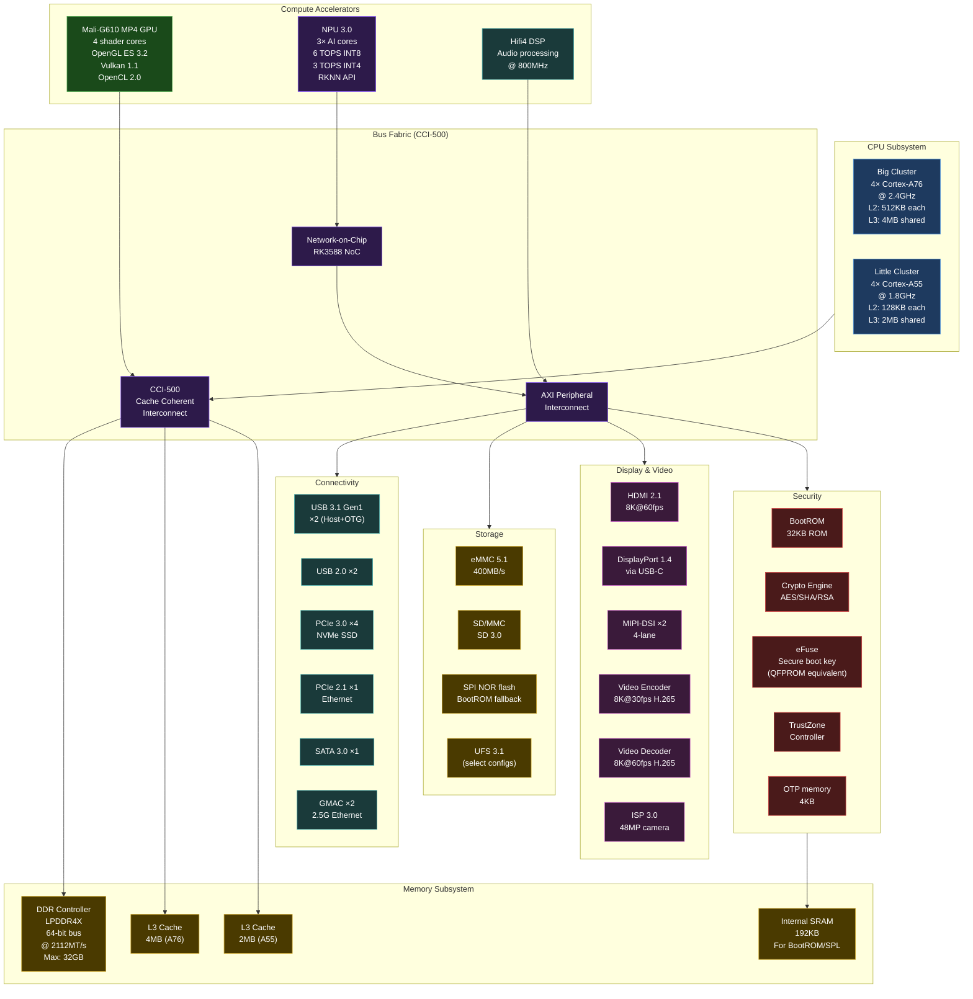
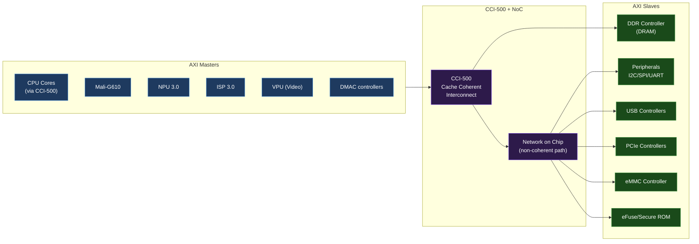

# 01 — SoC Internal Architecture (RK3588 Deep Dive)

> Understanding the SoC block diagram is the foundation for all BSP and driver work.  
> Reference board: Radxa Rock 5B+ (RK3588 SoC)

---

## Level 1: The 5-Year-Old Explanation

A SoC (System-on-Chip) is like a city on a tiny piece of silicon. Inside the city there are:
- Brains (CPU cores) — they think and do calculations
- A highway system (bus fabric) — lets all the parts talk to each other
- A memory warehouse (DDR controller) — stores all the data
- Workers with special skills (GPU, NPU, DSP) — do specific jobs faster
- Doors to the outside world (peripherals: UART, I2C, USB, PCIe) — connect to other hardware

---

## Level 2: Overview Diagram



---

## Level 3: The CPU Subsystem

### Big.LITTLE Architecture

```
RK3588 CPU Topology:
─────────────────────────────────────────────────────
  Big Cluster (performance)     Little Cluster (efficiency)
  ─────────────────────────     ─────────────────────────
  4× Cortex-A76 cores           4× Cortex-A55 cores
  2.4GHz max                    1.8GHz max
  512KB L2 per core             128KB L2 per core
  4MB L3 shared                 2MB L3 shared
  ARMv8.2-A ISA                 ARMv8.2-A ISA
  Out-of-order execute          In-order execute
  10-wide decode                5-wide decode

BSP Impact:
  - /sys/devices/system/cpu/cpu0-3  = A55 (little)
  - /sys/devices/system/cpu/cpu4-7  = A76 (big)
  - CPUFreq driver: rockchip-cpufreq.c
  - Thermal: rockchip-thermal.c
```

**Kernel command line to verify:**
```bash
# On Radxa 5B+ or QEMU with RK3588 DTB:
cat /sys/devices/system/cpu/cpu0/cpufreq/cpuinfo_max_freq
# 1800000  (A55: 1.8GHz)

cat /sys/devices/system/cpu/cpu4/cpufreq/cpuinfo_max_freq
# 2400000  (A76: 2.4GHz)

# Current topology
cat /sys/devices/system/cpu/cpu4/topology/core_id
```

### Cache Coherency (Critical for Driver Writing)

```
          CPU Core (A76)
             │
           L1 I$     L1 D$    (private, per-core)
             │         │
             └────┬────┘
                  │
                L2 $     (512KB, private per A76 core)
                  │
                  └──── CCI-500 ─────┐
                                     │
                              L3 Cache (4MB, shared A76)
                                     │
                              DDR Controller
                                     │
                               LPDDR4X DRAM
```

**Why this matters for driver writing:**
- DMA operations: device writes to DRAM, CPU needs to see correct data
- If CPU's cache line has stale data → coherency bug → wrong values read
- Solution: `dma_alloc_coherent()` or explicit `dma_sync_*` operations

```c
/* Correct DMA buffer allocation (coherent, no explicit cache ops) */
dma_addr_t dma_addr;
void *cpu_addr = dma_alloc_coherent(dev, size, &dma_addr, GFP_KERNEL);
// Device writes to dma_addr, CPU reads from cpu_addr → always consistent

/* Non-coherent (streaming DMA) — need explicit sync */
dma_addr_t dma_addr = dma_map_single(dev, cpu_ptr, size, DMA_FROM_DEVICE);
// ... device DMA transfer ...
dma_unmap_single(dev, dma_addr, size, DMA_FROM_DEVICE);
// NOW safe to read from cpu_ptr (cache has been invalidated)
```

---

## Level 4: Memory Map

```
RK3588 64-bit Physical Address Space:
──────────────────────────────────────────────────
0x0000_0000_0000_0000  BootROM (32KB)
0x0000_0000_0002_0000  Reserved
0x0000_0000_0008_0000  PMU (Power Management Unit)
0x0000_0000_0009_0000  GRF (General Register Files — clock/reset control)
0x0000_0000_00C0_0000  GIC-600 (Interrupt Controller)
0x0000_0000_00FD_0000  CRU (Clock & Reset Unit)
0x0000_0000_FD58_C000  IRAM (192KB)
0x0000_0000_FE20_0000  SARADC
0x0000_0000_FE2A_0000  I2C0–I2C8
0x0000_0000_FE60_0000  eMMC (SDHCI)
0x0000_0000_FE8C_0000  USB OTG
0x0000_0000_FE90_0000  USB HOST
0x0000_0000_FE18_0000  SPI0–SPI5
0x0000_0000_0003_0000  DDR Controller
0x0000_0000_0008_0000  DRAM starts (mapped by DDR controller)
```

**Reading the memory map in device tree:**
```bash
# On Radxa 5B+
cat /proc/iomem
# or
cat /sys/kernel/debug/iomap  # if CONFIG_IO_STRICT_DEVMEM=n

# View UART registers:
cat /proc/iomem | grep uart
# fe650000-fe653fff : fe650000.serial
# fe660000-fe663fff : fe660000.serial
```

---

## Level 5: Bus Fabric — How Everything Talks



---

## Interview Questions

**Beginner:**
- What is a SoC? How does it differ from a CPU?
- What is the difference between the "Big" and "Little" CPU clusters in big.LITTLE?
- What is IRAM and why does the BootROM use it?

**Intermediate:**
- What is cache coherency and why does it matter for DMA drivers?
- What is the CCI-500 and what problem does it solve?
- Explain the difference between `dma_alloc_coherent` and `dma_map_single`.

**Advanced:**
- How does the NPU access DRAM without going through the CPU's cache domain?
- Explain AXI protocol: what are burst transactions and why are they important for performance?
- How would you trace a bus hang (AXI timeout) on an RK3588?

**Expert:**
- Design a driver that implements zero-copy DMA from a camera ISP to an NPU. What memory regions, IOMMU configuration, and synchronization are needed?
- How does the SMMU-600 provide DMA isolation for different devices? What attack does it prevent?
- Explain how the GIC-600 handles an IRQ from the UART RX FIFO to the kernel ISR.

---

*Related: [../03_Memory_Map.md](03_Memory_Map.md) | [../08_Interrupt_Architecture.md](08_Interrupt_Architecture.md)*  
*Labs: [../../05_Practical_Labs/Lab_04_Read_PMIC_Over_I2C.md](../../05_Practical_Labs/Lab_04_Read_PMIC_Over_I2C.md)*
