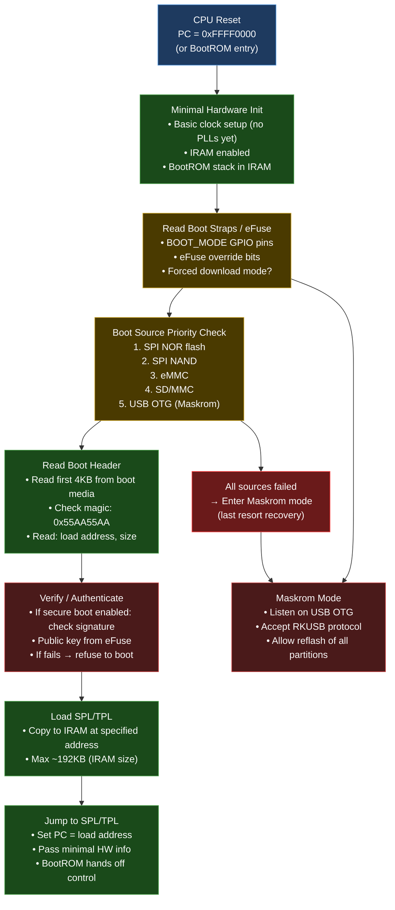

# 02 — BootROM Deep Dive

> The BootROM is the root of all trust. It executes before any software you write. Understanding it is essential for bring-up and secure boot.

---

## Level 1: The Simple Explanation

The BootROM is a tiny program baked into the silicon chip at the factory. It cannot be changed (it's Read-Only Memory). When the chip powers on, this is the very first code that runs. Its only job: figure out where the "real" software is stored and load it.

Think of it as the bouncer at a nightclub — it checks the ID (header magic number) before letting software in.

---

## Level 2: BootROM Constraints

BootROM code is written under the most extreme constraints in all of embedded software:

| Constraint | Value | Implication |
|-----------|-------|------------|
| Code size | 32–64KB | No complex library code |
| Available RAM | IRAM only (~192KB) | No DRAM — DDR not trained yet |
| Clock speed | Basic PLL only | ~200MHz at boot vs 2.4GHz normal |
| Debug output | Often none | If it fails, you see nothing |
| Code changes | IMPOSSIBLE | Bugs live forever in silicon |

---

## Level 3: BootROM Flow (RK3588)



---

## Level 4: BootROM Boot Media Detection

### Boot Priority (RK3588 Specific)

```c
/* From RK3588 Technical Reference Manual - Boot Flow */

/*
 * Boot mode priority (checked in order):
 * 
 * 1. BOOT_MODE pin override (GPIO):
 *    - Pull RECOVERY pin low → force SD card boot
 *    - Pull MASKROM pin low → force USB download mode
 *
 * 2. eFuse override:
 *    - SECURE_BOOT_DISABLE efuse → skip signature verification
 *    - BOOT_MEDIA_FUSE → force specific boot source
 *
 * 3. Normal priority:
 *    SPI NOR → SPI NAND → eMMC → SDMMC → USB OTG
 */

/* Boot header magic that BootROM checks */
#define RKFW_MAGIC          0x57464B52  /* "RKFW" */
#define IDB_MAGIC           0x0FF40000  /* RK idbloader magic */
#define UBOOT_MAGIC         0x56190527  /* U-Boot legacy image magic */
```

### The idbloader Format

```
RK3588 Boot Media Layout (eMMC/SD):
─────────────────────────────────────
Sector 0:    MBR / GPT header
Sector 64:   idbloader header (RK magic)
             ┌─────────────────────────┐
             │ magic: 0x0FF40000       │
             │ hash_type               │
             │ boot1_size              │
             │ boot2_size              │
             │ boot_flag               │
             └─────────────────────────┘
Sector 128:  TPL/SPL code (fits in IRAM, ~64KB)
Sector 4096: ATF BL31 + OP-TEE + U-Boot (in DRAM after DDR training)
```

---

## Level 4: What BootROM CAN and CANNOT Do

### CAN do:
- Execute code from IRAM
- Read from SPI NOR, eMMC, SD card (minimal drivers built-in)
- USB OTG communication (Maskrom protocol)
- Basic cryptographic verification (if secure boot enabled)
- Read eFuse bits for configuration

### CANNOT do:
- Access DRAM (not initialized yet)
- Use complex drivers (no space)
- Output UART messages (usually — some SoCs do output "DDR init" from BootROM)
- Be updated or patched (it's ROM)
- Run code larger than IRAM size

---

## Level 5: BootROM Bugs and Vulnerabilities

Since BootROM cannot be updated, bugs are permanent for a chip revision. Famous examples:

### Nintendo Switch BootROM Bug (Fusée Gelée, 2018)
- **Vulnerability:** Stack overflow in BootROM USB DFU handler
- **Impact:** Full unsigned code execution in BootROM context (before secure boot check)
- **Lesson:** BootROM input validation is critical — any input from untrusted source must be length-checked

### MediaTek BootROM UART Bypass
- **Vulnerability:** Before signature check completes, UART download mode accessible
- **Lesson:** Download mode must be gated behind the same security checks as normal boot

### Implication for your work:
When working on BootROM or early boot code:
- Every length from untrusted source (USB, storage) must be bounds-checked
- Stack usage must be minimal and analyzed
- No recursion
- All buffer sizes hardcoded, never dynamic

---

## Forcing Maskrom Mode (Recovery)

When your board won't boot normally, Maskrom mode is your rescue:

### RK3588 Methods:

**Method 1: Hardware button** (Radxa 5B+ has a Maskrom button)
```bash
# 1. Hold Maskrom button
# 2. Apply power (or press Reset while holding Maskrom)
# 3. Release Maskrom button after 2 seconds
# Board enters USB download mode
```

**Method 2: Short the eMMC clock pin**
```bash
# On bare PCB without maskrom button:
# Short eMMC CLK to GND (check schematic)
# This causes eMMC to not respond → BootROM falls back to USB
```

**Method 3: rkdeveloptool (from Linux host)**
```bash
# Install rkdeveloptool
sudo apt install rkdeveloptool
# OR build from source:
git clone https://github.com/rockchip-linux/rkdeveloptool
cd rkdeveloptool && autoreconf -i && ./configure && make
sudo make install

# Check if board is in Maskrom mode
rkdeveloptool ld
# Expected: DevNo=1 Vid=0x2207,Pid=0x350b,LocationID=...

# Download mode (after entering maskrom):
rkdeveloptool db rk3588_spl_loader.bin  # Download loader
rkdeveloptool wl 0x40 idbloader.img     # Write idbloader to sector 64
rkdeveloptool wl 0x4000 u-boot.itb      # Write U-Boot
rkdeveloptool rd                         # Reboot device
```

---

## Real-World Lab: Build Your Own SPL Minimal Loader

```c
/*
 * minimal_spl.c
 * Smallest possible ARM64 loader that BootROM can load and execute
 * Demonstrates: what SPL must do to get UART output
 *
 * Note: This is educational pseudocode — real SPL uses U-Boot TPL framework
 */

/* Memory-mapped UART (RK3588 UART2 debug port) */
#define UART2_BASE     0xFE650000UL
#define UART_THR       (UART2_BASE + 0x00)  /* Transmit Holding Register */
#define UART_LSR       (UART2_BASE + 0x14)  /* Line Status Register */
#define UART_LSR_THRE  (1 << 5)             /* TX empty */

static inline void uart_putc(char c)
{
    volatile uint32_t *lsr = (volatile uint32_t *)UART_LSR;
    volatile uint32_t *thr = (volatile uint32_t *)UART_THR;
    
    while (!(*lsr & UART_LSR_THRE))
        ;  /* Wait for TX buffer empty */
    *thr = (uint32_t)c;
}

static void uart_puts(const char *s)
{
    while (*s) {
        if (*s == '\n') uart_putc('\r');
        uart_putc(*s++);
    }
}

/*
 * Entry point — BootROM jumps here
 * x0 = 0 (no info from BootROM on RK3588)
 * Stack: set up by startup.S before calling this C function
 */
void spl_main(void)
{
    /* At this point: only IRAM available, basic clocks running */
    /* UART clock must be already configured by BootROM or startup code */
    
    uart_puts("SPL: Minimal loader started\n");
    uart_puts("SPL: No DDR yet — working in IRAM\n");
    
    /* Next step: call DDR training code */
    /* ddr_init(); */
    
    uart_puts("SPL: DDR training would go here\n");
    
    /* Hang — in real SPL, you'd load and jump to U-Boot */
    while (1) {}
}
```

```asm
/* startup.S — ARM64 entry point that BootROM jumps to */
.section .text._start
.global _start
_start:
    /* Disable interrupts */
    msr daifset, #0xf
    
    /* Set up stack in IRAM */
    ldr x0, =__spl_stack_top
    mov sp, x0
    
    /* Zero BSS segment */
    ldr x0, =__bss_start
    ldr x1, =__bss_end
1:  str xzr, [x0], #8
    cmp x0, x1
    b.lt 1b
    
    /* Call C entry */
    bl spl_main
    
    /* Should never return */
hang:
    b hang
```

---

## Interview Questions

**Beginner:**
- B1: What is BootROM? Can it be updated? Why not?
- B2: Why can't the BootROM access DRAM at startup?
- B3: What is Maskrom mode and when would you use it?

**Intermediate:**
- I1: Explain the boot source priority on RK3588. What happens if eMMC is corrupted?
- I2: What does the BootROM verify before loading the SPL? What constitutes a valid SPL header?
- I3: What is the difference between Maskrom mode and normal USB boot?

**Advanced:**
- A1: Design a minimal C program that BootROM could load. What constraints would you place on the code? (Stack size, no dynamic allocation, etc.)
- A2: How does secure boot chain start from the BootROM? What eFuse bits are involved?
- A3: The Fusée Gelée exploit used a BootROM USB stack buffer overflow. What mitigation would you design into a BootROM USB handler?

**Expert:**
- E1: You're writing a new SoC BootROM (in RTL simulation). Design the boot header format. What fields are needed? How do you handle endianness, version compatibility, and rollback prevention?
- E2: How would you implement BootROM-level attestation to ensure that only signed SPL code can run, while still allowing factory programming? Consider the key storage and revocation requirements.

---

*Next: [03_SPL_And_TPL.md](03_SPL_And_TPL.md)*  
*Related: [../../04_Complete_Boot_Flow_Visualization/01_Master_Boot_Flow_Diagram.md](../../04_Complete_Boot_Flow_Visualization/01_Master_Boot_Flow_Diagram.md)*
