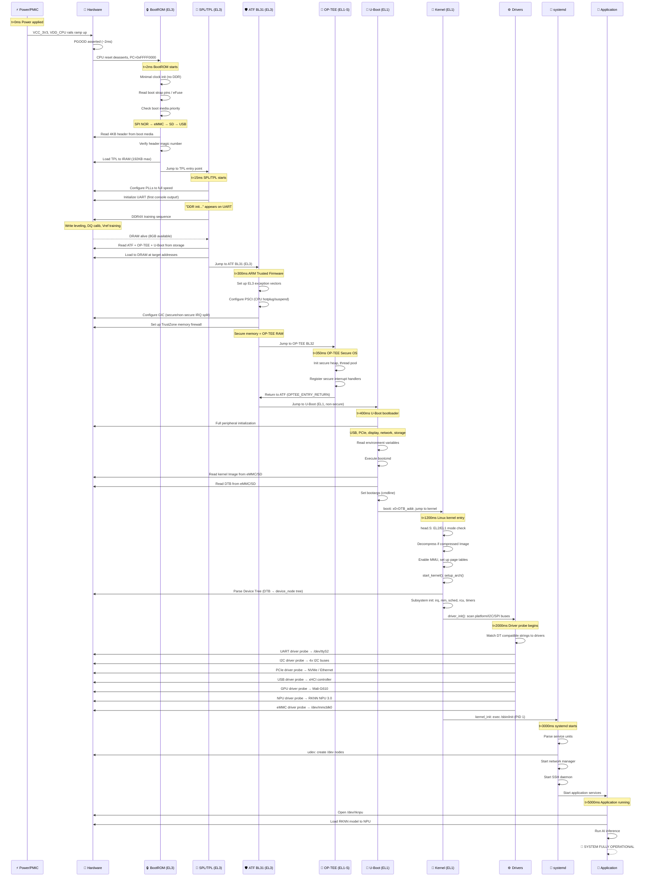
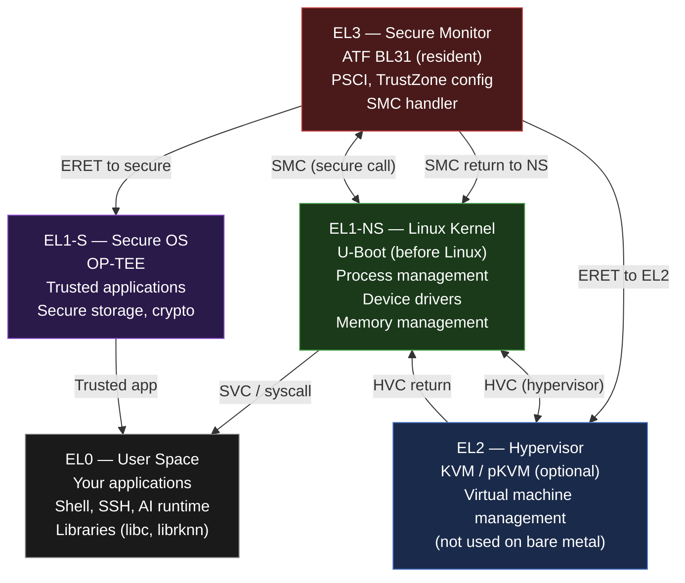
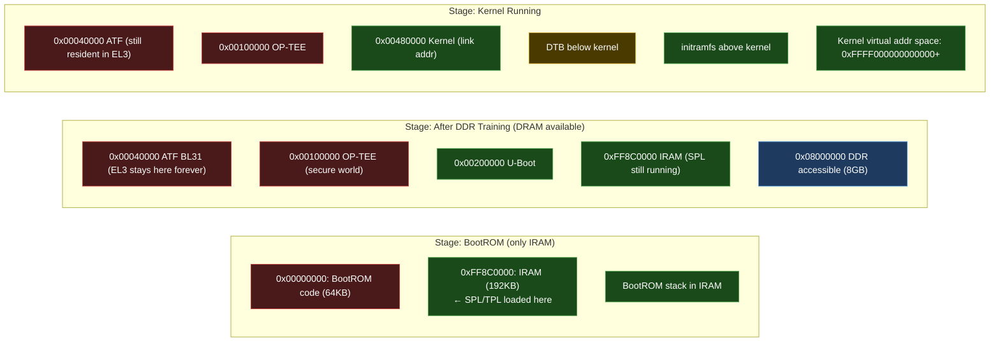
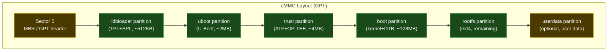

# 01 — Master Boot Flow Diagram

> **The most important diagram in this repository.**  
> This is the complete power-on to AI-inference-running boot flow for an ARM64 embedded Linux system (RK3588 / Radxa Rock 5B+ primary reference).

---

## The Complete Boot Flow



---

## Time Budget (Typical RK3588 System)

| Stage | Start | End | Duration | Optimization Potential |
|-------|-------|-----|----------|----------------------|
| Power ramp + POR | 0ms | 2ms | 2ms | None (hardware) |
| BootROM | 2ms | 15ms | 13ms | None (ROM) |
| SPL/TPL (DDR training) | 15ms | 300ms | 285ms | Minimal — DDR training is physics |
| ATF + OP-TEE | 300ms | 400ms | 100ms | Compile-time config |
| U-Boot | 400ms | 1200ms | 800ms | **High** — disable unused drivers |
| Kernel decompression | 1200ms | 1400ms | 200ms | Use uncompressed Image |
| Kernel init + subsystems | 1400ms | 2000ms | 600ms | **High** — modularize drivers |
| Driver probe | 2000ms | 3000ms | 1000ms | **High** — async probe |
| systemd + services | 3000ms | 5000ms | 2000ms | **High** — disable unused services |
| **Total to shell prompt** | | **~5s** | **5000ms** | Target: **< 2s** |

---

## The ARM Exception Level Diagram



---

## Memory Map at Each Boot Stage



---

## Flash Partition Map (eMMC / SD Card)



**Real commands to inspect on Radxa 5B+:**
```bash
# View partition table
lsblk
fdisk -l /dev/mmcblk0

# Read idbloader header
dd if=/dev/mmcblk0 bs=512 skip=64 count=1 | hexdump -C | head

# Check boot partition contents
mount /dev/mmcblk0p3 /mnt/boot
ls -la /mnt/boot/
# extlinux/extlinux.conf  ← U-Boot boot script
# Image                   ← Linux kernel
# rk3588-rock-5b.dtb      ← Device tree
```

---

## Debug Quick Reference

### Stage-by-Stage Failure Diagnosis

```
Q: Board is dead. No UART output. USB device not detected.
A: Power stage. Check:
   - Is 3V3 rail present? (probe with multimeter)
   - Is VDD_CPU_BIG present? (~0.95V under light load)
   - Is PGOOD signal asserted to SoC?
   - Is USB-C cable capable of power delivery?

Q: Board powers on. UART shows garbage characters.
A: UART baud rate mismatch OR SPL clock init issue.
   - Try different baud rates: 1500000, 115200, 921600
   - Check PLL configuration in SPL source

Q: UART shows "DDR init..." then hangs.
A: DDR training failure.
   - Wrong DDR frequency/timing in SPL config
   - Bad DDR solder joint or routing issue
   - Incompatible DRAM part (check SPL support matrix)

Q: "Starting kernel..." then nothing.
A: U-Boot → Kernel handoff issue.
   - Wrong kernel load address in U-Boot bootcmd
   - DTB not loaded or at wrong address
   - Kernel not compiled for this platform (defconfig)

Q: Kernel panics: "Kernel panic - not syncing: VFS: Unable to mount root"
A: rootfs issue.
   - Check: root=/dev/mmcblk0p5 in bootargs (or whatever partition)
   - Check: rootfstype=ext4 in bootargs
   - Check: kernel has mmcblk driver built-in (not as module)

Q: Driver not probing, device not appearing in /dev
A: DT compatible string mismatch.
   - cat /proc/device-tree/[node-name]/compatible
   - grep -r "compatible" drivers/[subsystem]/ | grep "your-string"
```

---

## AI-Assisted Boot Debug Workflow

```
When you have a boot failure, give this prompt to Claude/ChatGPT:

"I'm debugging a boot failure on an RK3588-based board.
The UART output stops after: [paste last 20 lines of output]
My boot configuration:
- TPL/SPL: [version/source]
- U-Boot: [version]  
- Kernel: [version + defconfig]
- DTB: [filename]
- Storage: [eMMC/SD]

What are the most likely causes? What should I check first?"
```

---

## Interview Questions

**Beginner (B):**
- B1: What happens in the very first milliseconds after power is applied to an embedded board?
- B2: Why can't BootROM access DRAM? What does it use instead?
- B3: What is the purpose of DDR training?

**Intermediate (I):**
- I1: Explain the ARM exception levels EL0–EL3 and which software runs at each level.
- I2: What is the role of ATF BL31 as a "resident monitor" — why does it stay resident?
- I3: How does U-Boot pass information to the Linux kernel at handoff?

**Advanced (A):**
- A1: A board outputs "DDR init..." then hangs. Walk through your debugging approach.
- A2: How does OP-TEE communicate with the Linux kernel? What is the TEE driver interface?
- A3: Explain how DT compatible string matching works — what happens between `booti` and the first driver `probe()` call?

**Expert (E):**
- E1: You're bringing up a new SoC. You have schematics and a datasheet but no BSP. The BootROM loads from SPI NOR. Walk through creating the minimal SPL to get UART output.
- E2: How does the kernel's PSCI client (`drivers/firmware/psci/psci.c`) call ATF BL31 for CPU hotplug? Trace the SMC call path.
- E3: Design a secure boot chain for RK3588 that uses hardware-backed key storage. What eFuse bits are involved? How does each stage verify the next?

---

*Previous: [00_The_Big_Picture/01_From_Idea_To_Running_System.md](../00_The_Big_Picture/01_From_Idea_To_Running_System.md)*  
*Next: [02_Boot_Stage_Debug_Guide.md](02_Boot_Stage_Debug_Guide.md)*  
*Labs: [../05_Practical_Labs/Lab_07_QEMU_Full_Boot_Stack.md](../05_Practical_Labs/Lab_07_QEMU_Full_Boot_Stack.md)*
