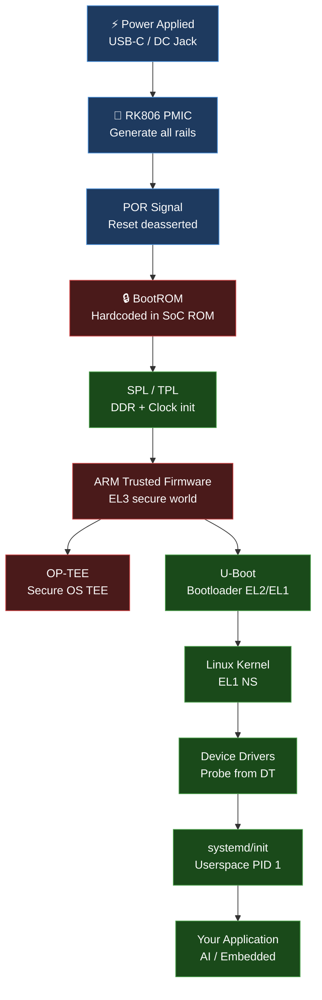

# 32 — Complete System Design & Boot Flow

> **The foundational section.** Understanding everything in this section means you can look at any embedded Linux system and know what every component does, how it was built, and how to debug it.

---

## Why Start Here

Most embedded engineers learn bits and pieces. They know U-Boot. They know how to write a driver. They know roughly what the kernel does.

**What most engineers lack:** a complete mental model of how everything connects — from power pin being energized to userspace application running.

This section gives you that complete picture.

---

## Section Structure

```
32_Complete_System_Design/
├── 00_The_Big_Picture/                     ← Start here (3 files)
│   ├── 01_From_Idea_To_Running_System.md   ← Master diagram: concept → production
│   ├── 02_Hardware_Prerequisites.md        ← Questions to ask HW engineers
│   └── 03_Anatomy_Of_An_Embedded_System.md ← 8-layer model
│
├── 01_SoC_Deep_Dive/                       ← Silicon internals (8 files)
│   ├── 01_SoC_Internal_Architecture.md     ← Full RK3588 block diagram
│   ├── 02_CPU_Architecture_For_BSP.md      ← ARM exception levels + coherency
│   ├── 03_Memory_Map.md                    ← 64-bit address space layout
│   ├── 04_Bus_Fabric.md                    ← AXI masters/slaves + NIC/CCI
│   ├── 05_Clock_System.md                  ← Crystal → PLLs → all clocks
│   ├── 06_Power_Architecture.md            ← USB-C → PMIC → all rails
│   ├── 07_Reset_And_Boot_Control.md        ← Reset sequence from power-on
│   └── 08_Interrupt_Architecture.md        ← Device IRQ → GIC → kernel handler
│
├── 02_Software_Artifacts/                  ← What lives in flash (8 files)
│   ├── 01_What_Software_Lives_On_Embedded.md
│   ├── 02_BootROM_Deep_Dive.md
│   ├── 03_SPL_And_TPL.md
│   ├── 04_ARM_TrustZone_Flow.md
│   ├── 05_U_Boot_Complete_Flow.md
│   ├── 06_Linux_Kernel_Boot_Flow.md
│   ├── 07_Init_System_Userspace.md
│   └── 08_Device_Tree_As_Hardware_DB.md
│
├── 03_How_Software_Is_Built/               ← Build system pipeline (8 files)
│   ├── 01_Complete_Build_Pipeline.md
│   ├── 02_How_BootROM_Code_Is_Made.md
│   ├── 03_How_ATF_Is_Built.md
│   ├── 04_How_U_Boot_Is_Built.md
│   ├── 05_How_Linux_Kernel_Is_Built.md
│   ├── 06_How_RootFS_Is_Built.md
│   ├── 07_How_Final_Image_Is_Assembled.md
│   └── 08_Flashing_And_Recovery.md
│
├── 04_Complete_Boot_Flow_Visualization/    ← The key diagrams (5 files)
│   ├── 01_Master_Boot_Flow_Diagram.md      ← THE most important file
│   ├── 02_Boot_Stage_Debug_Guide.md
│   ├── 03_Secure_Boot_Data_Flow.md
│   ├── 04_OTA_Update_Flow.md
│   └── 05_Boot_Time_Optimization.md
│
├── 05_Practical_Labs/                      ← 8 hands-on labs
│   ├── Lab_01_Trace_Boot_With_UART.md
│   ├── Lab_02_Add_UART_Print_To_SPL.md
│   ├── Lab_03_Force_Maskrom_Mode.md
│   ├── Lab_04_Read_PMIC_Over_I2C.md
│   ├── Lab_05_Add_DT_Node_And_Driver.md
│   ├── Lab_06_Boot_Time_Profiling.md
│   ├── Lab_07_QEMU_Full_Boot_Stack.md
│   └── Lab_08_RK3588_Radxa5B_Bringup.md
│
└── 06_Interview_QA/                        ← 80+ Q&A on system design
    ├── 01_System_Design_QA.md
    ├── 02_Boot_Flow_QA.md
    └── 03_Debug_Scenarios_QA.md
```

---

## The Master System Picture



---

## Reading Order

1. `00_The_Big_Picture/01_From_Idea_To_Running_System.md` — the mental model
2. `01_SoC_Deep_Dive/01_SoC_Internal_Architecture.md` — hardware foundation
3. `02_Software_Artifacts/02_BootROM_Deep_Dive.md` — where everything starts
4. `04_Complete_Boot_Flow_Visualization/01_Master_Boot_Flow_Diagram.md` — the key diagram
5. Any of the labs — reinforce understanding with real hardware/QEMU

---

## How This Section Connects to Your Projects

| Your Project | Files In This Section |
|-------------|----------------------|
| DW-UFS 4.0 QEMU model | `02_Software_Artifacts/01_What_Software_Lives_On_Embedded.md` (UFS partition map) |
| Coreboot SC7180/SC7280 | `02_Software_Artifacts/03_SPL_And_TPL.md` (SPL = Coreboot stage1) |
| QTEE/TrustZone | `02_Software_Artifacts/04_ARM_TrustZone_Flow.md` |
| QFPROM eFuse driver | `01_SoC_Deep_Dive/03_Memory_Map.md` (eFuse memory map) |
| Radxa 5B+ labs | `05_Practical_Labs/Lab_08_RK3588_Radxa5B_Bringup.md` |

---

*Start reading: [00_The_Big_Picture/01_From_Idea_To_Running_System.md](00_The_Big_Picture/01_From_Idea_To_Running_System.md)*
